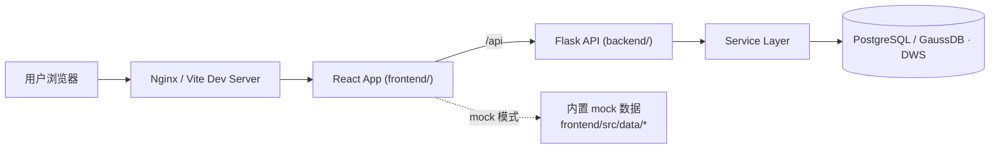

<div align="center">

# 见远而行数据资产管理与血缘分析软件

**一个轻量的数据仓库元数据管理门户 —— 让数据资产可见、可查、可维护。**

A lightweight metadata management portal for data warehouses: browse table assets,
trace field/table mappings, and maintain word roots, indicators, and upstream/downstream systems.

[](./LICENSE)


[快速开始](#-快速开始) · [功能模块](#-功能模块) · [架构](#-架构) · [文档](#-文档导航) · [路线图](#-路线图)

</div>

---

## 💡 这个项目解决什么问题

数据团队常常面临这样的困境：**表在哪、字段什么含义、口径从哪来、推到哪去——没人说得清，全靠口口相传和散落的 Excel。**

见远而行数据资产管理与血缘分析平台将这些元数据集中管理，让数仓建模、数据治理和 BI 支撑团队能够：

- 📚 **看清资产** —— 浏览各数据层级表资产、字段信息与 DDL，DWM 作为推荐筛选项
- 🔗 **追溯链路** —— 查询字段到字段、表到表的映射关系
- 🧩 **维护口径** —— 统一管理词根、指标、报表资产与 API 资产
- 🔄 **登记上下游** —— 管理上游卸数、下游推送及其元数据关系
- ⚙️ **配置管理** —— 维护后台用户与参数字典

> 它专注于"**元数据可见、可查、可维护**"，**不是**调度执行平台——不负责真实采集、任务编排或文件推送执行。

### Community Edition 与完整版

- **Community Edition**（本仓库默认）：开箱即用的元数据管理门户。支持 **SQLite**（零依赖本地演示 / 开发 / CI）与 **PostgreSQL**，数据库初始化走受管迁移 + 零售虚构演示数据 seed，无任何真实业务数据依赖。
- **完整版（Enterprise）**：在 Community 能力之外增加报表资产、上游卸数、下游推送、码值表维护等私有/企业能力（需对应部署与数据库支持，GaussDB / DWS）。

两者共享同一代码库：Community 通过 `backend/configs/community.yaml` 声明启用的模块集，完整版按需部署对应模块。本仓库定位为 Community Edition，完整版模块的接口与数据表以文档形式保留参考。

### 适用团队

数仓建模与开发团队 · 数据治理 / 元数据治理团队 · 数据产品 / 数据运营 / BI 支撑团队 · 需要维护上下游元数据口径的平台团队

---

## 🧩 功能模块

> 标注：✅ = Community 版可用；🔒 = 完整版（含私有/企业能力）专属。
> Community 版运行时默认只启用 ✅ 模块，其余模块的菜单与接口在 Community 配置下处于关闭状态（源码仍随仓库提供，见 [Edition 说明](#-community-edition--完整版))。

| 模块 | 能力 | 版本 |
|------|------|------|
| **数据仓库** | 全部已配置层级的表资产列表、详情、字段、DDL，支持 DWM / DWA / DM 等层级筛选及新增 / 编辑 / 删除 | ✅ |
| **字段映射** | 字段视图、表视图、统计、CSV 导出 | ✅ |
| **血缘分析** | 表/任务血缘子图、上下游影响、关系证据与快照发布 | ✅ |
| **词根管理** | 列表、分类、新增 / 编辑 / 删除、批量导入 | ✅ |
| **指标维护** | 列表、详情、新增 / 编辑 / 启停 / 删除 | ✅ |
| **API 资产** | API 元数据、参数、响应字段与资产关系维护 | ✅ |
| **系统管理** | 用户管理、菜单管理（启停 / 排序）、参数字典、用户状态切换、重置密码 | ✅ |
| **认证** | 登录、当前用户、登出（mock 演示登录 / db 真实登录） | ✅ |
| **报表资产** | 报表台账、归属与关联资产维护 | 🔒 |
| **上游卸数** | 系统列表、详情、新增 / 编辑 / 启停 / 删除 | 🔒 |
| **下游推送** | 系统管理、作业管理、作业字段管理 | 🔒 |
| **码值表维护** | 湖仓手工码值表元数据维护与导出 | 🔒 |

> 各模块接口与数据表明细见 [模块清单](./docs/modules.md)。

---

## 📸 项目预览

> 界面截图将在正式发布前使用虚构零售演示数据（`demo/datasets/`）重新拍摄后补充。
> 当前可直接体验：`demo/datasets/`（全渠道零售虚构数据）与前端 mock 模式
> （`VITE_API_MODE=mock`，演示登录 `admin / admin123`）。

---

## 📑 目录

- [快速开始](#-快速开始)
- [功能模块](#-功能模块)
- [界面预览](#-界面预览)
- [架构](#-架构)
- [配置说明](#-配置说明)
- [部署](#-部署)
- [项目结构](#-项目结构)
- [常见问题](#-常见问题)
- [路线图](#-路线图)
- [贡献](#-贡献)
- [许可证](#-许可证)
- [文档导航](#-文档导航)

---

## 🚀 快速开始

> 推荐**首次体验先用纯 mock 模式**：无需数据库、无需后端，前端开箱即跑（演示登录 `admin / admin123`）。

**环境要求：** Node.js 22.13+（推荐 24）· npm 10+。

```bash
# 1. 克隆并进入项目
cd data-asset-portal

# 2. 安装前端依赖（lineage-viewer 等为仓库内 npm workspaces，npm ci 从本地源码链接）
cd frontend
npm ci
cd ..

# 3. 配置 mock 模式
cp frontend/.env.example frontend/.env.local
# 在 frontend/.env.local 中设置: VITE_API_MODE=mock

# 4. 启动前端
npm --prefix frontend run dev
```

打开浏览器访问前端控制台输出的地址，使用 `admin / admin123` 即可登录体验。

<details>
<summary><b>接入真实数据库（remote 模式）</b></summary>

**环境要求：** Node.js 22.13+（推荐 24）· Python 3.10+ · PostgreSQL 或 GaussDB / DWS

```bash
# 后端：创建虚拟环境并安装依赖
python -m venv backend/.venv
source backend/.venv/bin/activate          # Windows: .\backend\.venv\Scripts\Activate.ps1
pip install -r backend/requirements.txt

# 后端：复制模板并设置必填的随机 Session 密钥
cp backend/.env.example backend/.env.local
# 在 backend/.env.local 中设置：
# FLASK_SECRET_KEY=<generate-a-strong-random-value>
# 本地 HTTP 联调另加：FLASK_ENV=development

# 启动后端（默认监听 127.0.0.1:5099）
python backend/run.py
```

#### 数据库初始化

> **Schema Source of Truth = `backend/migrations`（manifest + 方言 SQL）。**
> Community 新安装的唯一官方初始化路径是 migration → seed（下方 **Community 本地运行**）；
> `docs/pg|dws` 的模块 DDL 仅作为完整版（含 Private 模块）的参考文档，
> 不再作为 Community 初始化机制。

<details>
<summary><b>Community 本地运行（SQLite / PostgreSQL）</b></summary>

无需手动建表；受管迁移会创建 Community core 表（含菜单、码值、审计日志表），
demo seed 写入完全虚构的零售演示数据。

```bash
# SQLite（零依赖，推荐首次体验）
cp backend/.env.example backend/.env.local
# backend/.env.local 中设置：
# FLASK_SECRET_KEY=<generate-a-strong-random-value>
# ASSET_RUNTIME_PROFILE=community   # 加载 backend/configs/community.yaml
# ASSET_DB_PROFILE=community_sqlite # 对应 backend/configs/database.community.yaml
# ASSET_DB_DATABASE=<绝对路径>/community.db

python backend/run.py
```

首次启动前执行受管迁移并 seed（也可以使用 `community_postgres` profile 跑 PostgreSQL）：

```bash
python backend/scripts/schema_migrate.py apply --profile community_sqlite
python demo/seed_sqlite.py --database <绝对路径>/community.db
```

PostgreSQL 的 Community 初始化同理：`schema_migrate.py apply --profile community_postgres`
后执行 `python demo/seed_postgres.py`（输出 SQL 到目标库）。

</details>

<details>
<summary><b>完整版（含 Private 模块：upstream / push / report / codeTable）</b></summary>

> ⚠️ **没有"一键初始化"脚本，也不要让后端去初始化数据库。** 请按需手动、逐个执行
> 模块 DDL，自己掌控对哪个库、跑哪些表，避免误清生产数据。

按 profile 的数据库类型选择脚本目录：PostgreSQL 用 [`docs/pg/`](./docs/pg/)，
GaussDB / DWS 用 [`docs/dws/`](./docs/dws/)。这些 DDL 同时创建 Private 模块表
与血缘快照表，是完整版部署的初始化参考；Community 初始化请走上方 migration 路径。
Cloudflare D1 不在支持范围内。配置缺失或类型非法时后端必须启动失败，不会回退到本地文件库。
每个模块一份 DDL（建表 + 基础数据，均为幂等的 `IF NOT EXISTS` / `INSERT ... WHERE NOT EXISTS`，可安全重复执行）：

```bash
# 以 PostgreSQL 为例，逐个模块执行（DWS 改用 docs/dws/ 下同名 *-dws-ddl.sql，并用 gsql）
psql "<连接串>" -f docs/pg/common-codes-app-pg-ddl.sql
psql "<连接串>" -f docs/pg/assets-app-pg-ddl.sql
psql "<连接串>" -f docs/pg/upstream-app-pg-ddl.sql
psql "<连接串>" -f docs/pg/field-mappings-app-pg-ddl.sql
psql "<连接串>" -f docs/pg/indicators-app-pg-ddl.sql
psql "<连接串>" -f docs/pg/push-app-pg-ddl.sql
psql "<连接串>" -f docs/pg/roots-app-pg-ddl.sql
psql "<连接串>" -f docs/pg/reports-app-pg-ddl.sql
psql "<连接串>" -f docs/pg/api-assets-app-pg-ddl.sql
psql "<连接串>" -f docs/pg/lineage-app-pg-ddl.sql
psql "<连接串>" -f docs/pg/manual-code-tables-app-pg-ddl.sql
psql "<连接串>" -f docs/pg/auth-app-pg-ddl.sql
psql "<连接串>" -f docs/pg/operation-logs-app-pg-ddl.sql
psql "<连接串>" -f docs/pg/menus-app-pg-ddl.sql
```

> 🚫 **仓库不再包含任何整库快照文件**（`app-*-init-data.sql` 与 `docs/*/sample/*.sql`
> 已从公开树移除，原为真实业务数据库导出）。如需 SQL 形式演示数据，请从安全演示源生成：
> `python demo/generate_demo_sql.py`（基于 `demo/datasets/` 全渠道零售虚构数据，
> 默认输出到 git-ignored 的 `tmp/demo-sql/`）。
>
> 管理员账号：Community demo seed 会创建 `community_demo / demo-change-me` 演示管理员；
> 完整版手动建库时，首个 admin 账号请在 `p_admin_user` 中手动插入（密码需用
> `backend/app/services/auth_service.py::build_password_hash` 生成哈希）。

```bash
# 前端切换到 remote 模式
cp backend/.env.example backend/.env.local
# 在 frontend/.env.local 中设置: VITE_API_MODE=remote
# 内网慢链路可按需覆盖请求超时(毫秒)，例如:
# VITE_API_TIMEOUT=60000
npm --prefix frontend run dev
```

数据库配置示例见 `backend/configs/database.example.yaml`，可通过 `ASSET_DB_CONFIG_PATH` 指向自定义路径。

</details>

<details>
<summary><b>Windows 一键启动脚本</b></summary>

```powershell
# 同时拉起前后端（依次调用 backend / frontend 的 dev 脚本，日志写入 logs/）
powershell -ExecutionPolicy Bypass -File .\scripts\dev-all.ps1
```

</details>

---

## 🏗 架构

前后端分离的单体门户 + 单体 API + 单库配置：



- **前端** `frontend/` —— React 18 + Vite 7 单页应用，API 层按模块拆分，`VITE_API_MODE` 决定走 mock 数据还是远程 `/api`
- **后端** `backend/` —— Flask 3 API，服务层统一读写数据库，按模块划分蓝图（`/api/assets`、`/api/field-mappings` …）
- **数据库** —— 后端通过 profile 的 `type` 切换驱动，支持 **SQLite**（Community 本地演示/开发/CI）、**PostgreSQL**（Community 与完整版）与 **GaussDB / DWS**（`gaussdb`，仅完整版，需可选 JDBC 驱动），实现见 `backend/app/db/`。**Community schema 的唯一初始化入口是 `backend/migrations`（受管迁移 + demo seed）**；`docs/pg/` 与 `docs/dws/` 的模块 DDL 作为完整版参考文档，每模块含主表、明细表与变更日志表

> 完整架构、数据流与数据库结构见 [docs/architecture.md](./docs/architecture.md)。

---

## ⚙️ 配置说明

项目只有**一个运行模式开关**：前端的 `VITE_API_MODE`，它同时决定数据来源与认证方式。后端始终连接数据库，无模式开关。

| 值 | 数据 | 认证 |
|----|------|------|
| `mock` | 前端内置 mock 数据 | 演示登录 `admin / admin123`，不调用后端 |
| `remote` | 通过 `/api` 调后端真实数据库 | 真实登录 |

后端配置使用 `backend/configs/database.yaml` 中的 profile（从 `database.example.yaml`
复制后填写，实配文件不入库）；环境文件按
`<root>/.env` → `<root>/.env.local` → `backend/.env` → `backend/.env.local` 顺序加载，
本地配置请从对应的 `.env.example` 复制。

后端的 `FLASK_SECRET_KEY` 是必填项，缺失或空白时会拒绝启动；不要使用固定值或把真实值写入仓库、日志、命令历史。`FLASK_DEBUG` 默认关闭。Nginx / Vite 的 `/api` 代理是同源部署，通常无需 CORS；只有跨源部署时才配置精确的 `FLASK_CORS_ORIGINS` allowlist。Cookie 在默认/生产模式使用 `Secure=True`，本地 HTTP 联调需显式设置 `FLASK_ENV=development`。

> 完整环境变量清单与本地开发说明见 [DEVELOPMENT.md](./DEVELOPMENT.md)。

---

## 📦 部署

```bash
# 前端构建，产物输出到 frontend/dist/
npm --prefix frontend run build
```

后端无单独打包步骤，部署时直接使用 `backend/` 源码与环境配置。典型内网部署为
Nginx 托管 `frontend/dist` 静态产物，并将 `/api` 反代到 Flask。

完整部署说明（含内网 / Nginx 反代）见 [DEPLOYMENT.md](./DEPLOYMENT.md)。

---

## 📂 项目结构

```text
data-asset-portal/
├── frontend/                 # React + Vite 单页应用（npm workspace root）
│   ├── packages/             # 内置 npm workspaces：lineage-viewer 三包源码（前端直接构建，无需外部 npm 包）
│   │   ├── lineage-viewer/            # lineage-viewer 核心 Web Component
│   │   ├── lineage-viewer-react/      # @lineage-viewer/react
│   │   └── lineage-viewer-domain-adapter/  # @lineage-viewer/domain-adapter
│   └── src/
│       ├── api/              # 按模块拆分的数据访问层（http.js 为公共封装）
│       ├── components/
│       │   ├── views/        # 各模块主视图（AssetView、PushView …）
│       │   ├── sidebar/      # 各模块侧边栏
│       │   ├── common/       # 公共组件（ConfirmDialog、toast、Modals）
│       │   ├── system/       # 系统管理子页面
│       │   └── OperationLog/ # 操作日志子页面
│       ├── hooks/            # 领域业务 hook（useAssetModule、useTheme …）
│       ├── data/             # mock 数据（仅 VITE_API_MODE=mock 时使用）
│       ├── routing/          # URL 与页面状态解析
│       ├── config/           # 默认配置与版本号
│       ├── constants/        # 公共常量（如 dataTypes 字段类型）
│       ├── utils/            # 通用工具（assetFilters 等）
│       └── styles/           # 全局样式
│       └── components/sidebar/common/  # 侧边栏公共构件（buildSidebarFacetItems 等）
├── backend/                  # Flask API 服务
│   ├── app/{db,routes,services}/
│   ├── app/utils/            # 后端工具（ddl_generator、data_types）
│   ├── configs/              # 数据库 profile 配置
│   └── scripts/              # db_to_init_sql.py、dev-backend.ps1 等
├── docs/                     # 架构 / 模块 / API / 设计文档
│   ├── pg/  dws/             # PostgreSQL / GaussDB·DWS 模块 DDL
│   ├── asset-risk-integration-design.md
│   ├── semantic-recommendation-roadmap.md
│   └── todo.md               # 当前未完成事项
├── backend/migrations/       # 唯一受管数据库迁移目录
├── demo/                     # 安全演示数据：datasets/*.json + seed/validate 脚本（唯一数据源）
├── scripts/                  # 根目录脚本：dev-all.ps1（一键启停）、sync_from_pg.py（测试库导出，默认输出到 git-ignored 目录）
├── CHANGELOG.md              # 更新日志
├── CONTRIBUTING.md           # 贡献指南
├── DEPLOYMENT.md             # 部署说明
├── DEVELOPMENT.md            # 开发指南
└── README.md
# 注：videos/ 为宣传片素材目录，体积较大，默认不入库（见 .gitignore）
```

---

## ❓ 常见问题

<details>
<summary>如何判断当前是 mock 还是 remote 模式？</summary>

只看 `VITE_API_MODE`：`mock` 表示前端读内置数据、不碰后端；`remote` 表示前端调后端、后端连真实数据库。

如果内网环境页面出现“接口请求超时（60秒）”或“接口请求超时（120秒）”，优先检查前后端统一超时配置是否偏小：

- 前端 `frontend/.env.local`：`VITE_API_TIMEOUT=60000`
- 后端 `backend/.env.local`：`ASSET_DB_CONNECT_TIMEOUT_SECONDS=30`、`ASSET_DB_STATEMENT_TIMEOUT_MS=120000`

统一搜索会顺序查询多类资产，耗时通常高于普通列表接口；当前通过统一长超时策略处理，不再单独暴露搜索超时变量。
</details>

<details>
<summary>前端能启动，但页面没有真实数据？</summary>

常见原因：① `VITE_API_MODE=mock`（本就读 mock 数据）；② `VITE_API_MODE=remote` 但后端未启动；③ `VITE_BACKEND_URL` 地址不正确。
</details>

<details>
<summary>后端端口如何配置？</summary>

默认 `127.0.0.1:5099`。在 `backend/.env.local` 中设置 `FLASK_PORT` 可覆盖。
</details>

---

## 🗺 路线图

v0.1.0 当前**不包含**以下能力，欢迎讨论与共建：

- [ ] 真实采集调度执行、任务编排、失败重试
- [ ] 真实下游文件推送执行链路
- [ ] 细粒度 RBAC / 多角色权限体系
- [ ] 完整审计中心、告警中心、运维中心
- [ ] 自动血缘解析、自动元数据采集

阶段更新记录见 [CHANGELOG.md](./CHANGELOG.md)，待确认事项见 [docs/todo.md](./docs/todo.md)。

---

## 🤝 贡献

欢迎提交 Issue 与 Pull Request。建议先阅读 [贡献指南](./CONTRIBUTING.md)与[开发指南](./DEVELOPMENT.md)。

---

## 📄 许可证

本项目基于 [Apache License 2.0](./LICENSE) 开源。

---

## 🙏 致谢

感谢以下开源项目，本门户构建于其上：

- [React](https://react.dev/) · [Vite](https://vitejs.dev/) —— 前端框架与构建工具
- [Flask](https://flask.palletsprojects.com/) —— 后端 API 框架
- [PostgreSQL](https://www.postgresql.org/) / GaussDB · DWS —— 数据存储

同时感谢所有提交 Issue 与 Pull Request 的贡献者。

---

## 📚 文档导航

| 文档 | 内容 |
|------|------|
| [架构说明](./docs/architecture.md) | 前后端架构、数据流、数据库结构 |
| [开发指南](./DEVELOPMENT.md) | 环境变量、本地开发 |
| [部署说明](./DEPLOYMENT.md) | 构建与部署 |
| [模块清单（文档）](./docs/modules.md) | 功能模块接口与数据表明细 |
| [API 契约](./docs/api-contract.md) | 接口约定 |
| [数据库迁移](./backend/migrations/README.md) | 受管迁移、CLI 与运维规则 |
| [资产风险联动设计](./docs/asset-risk-integration-design.md) | 当前风险展示边界与外部审计接入提案 |
| [智能问数与语义推荐](./docs/semantic-recommendation-roadmap.md) | 问数底座定位、技术候选与落地前置条件 |
| [待确认事项](./docs/todo.md) | 当前尚未完成或待决策事项 |
| [更新日志](./CHANGELOG.md) | 阶段性变更 |
| [贡献指南](./CONTRIBUTING.md) | 参与共建 |

---

## License

Licensed under the Apache License, Version 2.0. See the [LICENSE](./LICENSE) file for the full license text, and [NOTICE](./NOTICE) for attribution notices.

Copyright 2025 Jearhe (overme.cn)
