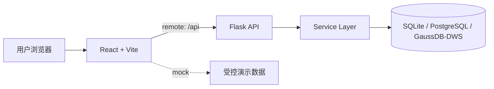

<div align="center">

# 数据资产门户

**一个轻量的数据仓库元数据管理门户 —— 让数据资产可见、可查、可维护。**

A lightweight metadata management portal for data warehouses: browse table assets,
trace field/table mappings, and maintain roots, indicators, and downstream metadata.

[](./LICENSE)
[](https://github.com/0verme/data-asset-portal-community/actions/workflows/ci.yml)


[快速开始](#-快速开始) · [社区入口](#-社区入口) · [功能模块](#-功能模块) · [文档](#-文档导航)

</div>

---

## 💡 这是什么

数据团队经常需要回答：**表在哪、字段是什么意思、口径从哪里来、数据流向哪里？**
数据资产门户把这些元数据集中到一个可搜索、可维护的界面中，服务于数仓建模、数据治理和 BI 支撑团队。

它专注于**元数据可见、可查、可维护**，不是调度执行平台：不负责真实采集、任务编排或文件推送执行。

## 📸 项目预览

以下截图来自仓库内 `demo/datasets/` 的虚构零售数据，展示真实的 DB → Service → API → Frontend 链路：

<table>
  <tr>
    <td width="50%" valign="top" align="center">
      
      <br><sub><b>资产搜索与发现</b></sub>
    </td>
    <td width="50%" valign="top" align="center">
      
      <br><sub><b>数据资产管理</b></sub>
    </td>
  </tr>
  <tr>
    <td width="50%" valign="top" align="center">
      
      <br><sub><b>字段映射</b></sub>
    </td>
    <td width="50%" valign="top" align="center">
      
      <br><sub><b>资产详情</b></sub>
    </td>
  </tr>
</table>

更多页面见 [截图画廊](./docs/screenshots.md)。

## 🚀 快速开始

### Community Demo（完整数据链路，推荐首次体验）

需要 Python 3.10+、Node.js 22.13+ 和 npm 10+。脚本会在项目目录内准备后端 virtualenv、前端依赖、SQLite、migration、Community seed，并启动真实 API 与前端。

Linux/macOS：

```bash
git clone https://github.com/0verme/data-asset-portal-community.git
cd data-asset-portal-community
./scripts/demo.sh
```

Windows PowerShell：

```powershell
git clone https://github.com/0verme/data-asset-portal-community.git
cd data-asset-portal-community
.\scripts\demo.ps1
```

启动后按终端输出打开 Demo URL，使用账号 `community_demo / demo-change-me` 登录。
初始化但不启动服务时，使用 `./scripts/demo.sh --init-only` 或
`.\scripts\demo.ps1 -InitOnly`。详细说明见 [Community Demo 指南](./docs/community-demo.md)。

### 只看前端（mock）

只需 Node.js 22.13+ 和 npm 10+；mock 模式不需要数据库或后端服务。

```bash
npm --prefix frontend ci
cp frontend/.env.example frontend/.env.local
npm --prefix frontend run dev
```

确认 `frontend/.env.local` 中为 `VITE_API_MODE=mock` 后，使用 `admin / admin123` 登录。
mock 数据只用于前端体验，不会写入数据库。

## 🤝 社区入口

- **使用项目** → [文档导航](#-文档导航) 和 [Community Demo 指南](./docs/community-demo.md)
- **有问题** → [GitHub Discussions · Q&A](https://github.com/0verme/data-asset-portal-community/discussions/categories/q-a)
- **发现 Bug** → [Bug Report Issue Form](https://github.com/0verme/data-asset-portal-community/issues/new?template=bug_report.yml)
- **想参与贡献** → [Good First Issues](https://github.com/0verme/data-asset-portal-community/issues?q=is%3Aissue+is%3Aopen+label%3A%22good+first+issue%22) · [CONTRIBUTING.md](./CONTRIBUTING.md)
- **安全问题** → 阅读 [SECURITY.md](./SECURITY.md)，通过 GitHub Private Vulnerability Reporting 私密提交；不要发到公开 Issue 或 Discussion。

## 🧩 功能模块

核心 Community profile 默认启用：

- **数据仓库**：浏览表、字段、层级、主题域和 DDL。
- **字段映射与血缘分析**：追溯字段/表关系，查看有限血缘子图与关系证据。
- **词根与指标**：维护命名词根、指标口径和指标路径。
- **API 资产**：维护 API 元数据、参数、响应字段和资产关系。
- **统一搜索与系统管理**：跨资产搜索，并维护用户、菜单、参数字典和操作日志。

### Optional 模块

报表资产、上游卸数、下游推送和码值表维护属于 **Optional — disabled by default** 模块，
由 `backend/configs/community.yaml` 的 runtime profile 控制，Community 默认不注册其路由、菜单和数据表。
完整模块清单见 [docs/modules.md](./docs/modules.md)。

> **许可与运行时是两个独立概念：**本仓库包含的模块源码均按 Apache-2.0 License 提供。
> “Optional” 只描述默认 runtime profile，不表示另一种 license、commercial edition 或 closed-source module。
> 关闭模块是默认运行时边界，不是源码访问或再分发限制；部署可选模块前请确认对应数据库和运维条件。

## 🏗 架构概览



前端通过 `VITE_API_MODE` 选择 mock 或 remote；后端按 database profile 访问数据库。
Community 新安装的 schema 唯一入口是 `backend/migrations`，随后使用 `demo/seed_*.py` 写入虚构数据。
详见 [架构说明](./docs/architecture.md) 和 [数据库迁移说明](./backend/migrations/)。

## 📚 文档导航

| 文档 | 内容 |
|------|------|
| [Community Demo](./docs/community-demo.md) | SQLite / PostgreSQL 多步骤演示数据初始化 |
| [首次贡献指南](./docs/first-contribution.md) | Fork、分支、测试和 PR walkthrough |
| [Good First Issue 提案](./docs/good-first-issues.md) | 已审计的 contributor-friendly backlog 提案 |
| [贡献指南](./CONTRIBUTING.md) | Issue、PR、代码风格和标签语义 |
| [开发指南](./DEVELOPMENT.md) | 环境变量、本地开发与测试矩阵 |
| [部署说明](./DEPLOYMENT.md) | 构建、Nginx 反代和部署注意事项 |
| [架构说明](./docs/architecture.md) | 前后端架构、数据流和数据库边界 |
| [模块清单](./docs/modules.md) | 页面、接口入口和数据表对照 |
| [API 契约](./docs/api-contract.md) | API 约定、端点和请求/响应模型 |
| [数据库迁移](./backend/migrations/) | 受管 migration CLI 与运维规则 |
| [截图画廊](./docs/screenshots.md) | Community Demo 全量界面截图 |
| [资产风险联动设计](./docs/asset-risk-integration-design.md) | 外部审计结果接入边界与提案 |
| [智能问数与语义推荐](./docs/semantic-recommendation-roadmap.md) | 问数底座与语义推荐路线 |
| [待确认事项](./docs/todo.md) | 当前尚未完成或待决策事项 |
| [更新日志](./CHANGELOG.md) | 阶段性变更 |

## ❓ 常见问题

### 支持哪些数据库？

SQLite 用于 Community 本地演示、开发和 CI；PostgreSQL 用于 Community 与完整部署；GaussDB / DWS
用于完整部署场景。当前不支持 Cloudflare D1。验证范围和初始化命令见 [开发指南](./DEVELOPMENT.md)。

### mock 和 remote 有什么区别？

`VITE_API_MODE=mock` 只读取前端内置数据，使用 `admin / admin123` 演示登录；`remote` 通过 `/api`
访问后端真实数据库，需要先按 [Community Demo](./docs/community-demo.md) 或 [开发指南](./DEVELOPMENT.md) 配置。

### 这个项目负责真实数据采集吗？

不负责。项目维护元数据和关系展示；采集调度、任务编排、失败重试和真实文件推送不在当前职责内。

## 🗺 路线图

当前版本不包含以下能力，欢迎先在 Discussions 讨论设计，再提交有边界的 Issue：

- 真实采集调度、任务编排和失败重试
- 真实下游文件推送执行链路
- 细粒度 RBAC、多角色权限体系和完整审计中心
- 自动血缘解析与自动元数据采集

阶段更新见 [CHANGELOG.md](./CHANGELOG.md)，待确认事项见 [docs/todo.md](./docs/todo.md)。

## 🤝 贡献

欢迎从 [Good First Issues](https://github.com/0verme/data-asset-portal-community/issues?q=is%3Aissue+is%3Aopen+label%3A%22good+first+issue%22) 开始，
并阅读 [首次贡献指南](./docs/first-contribution.md) 与 [CONTRIBUTING.md](./CONTRIBUTING.md)。

## 📄 许可证

本项目基于 [Apache License 2.0](./LICENSE) 开源。第三方归属说明见 [NOTICE](./NOTICE)。

---

## License

Licensed under the Apache License, Version 2.0. See the [LICENSE](./LICENSE) file for the full license text,
and [NOTICE](./NOTICE) for attribution notices.

Copyright 2025 Jearhe (overme.cn)
