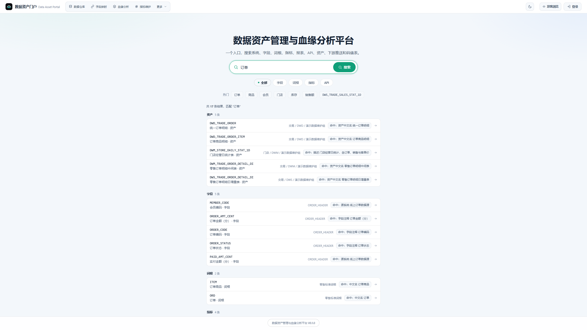
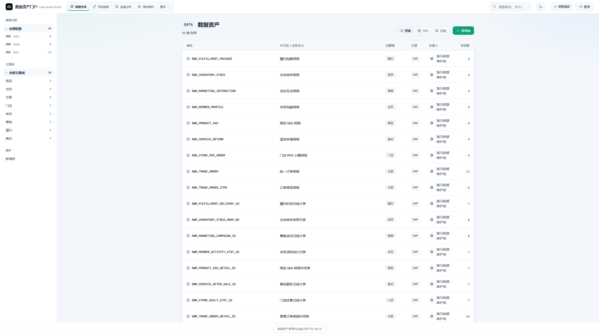
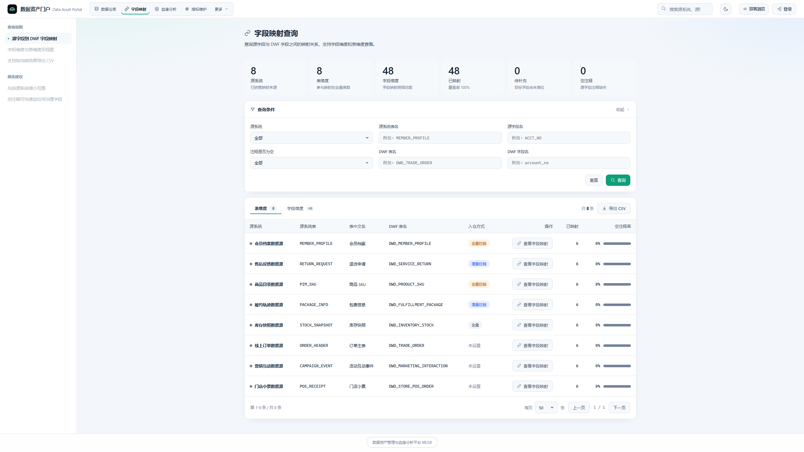
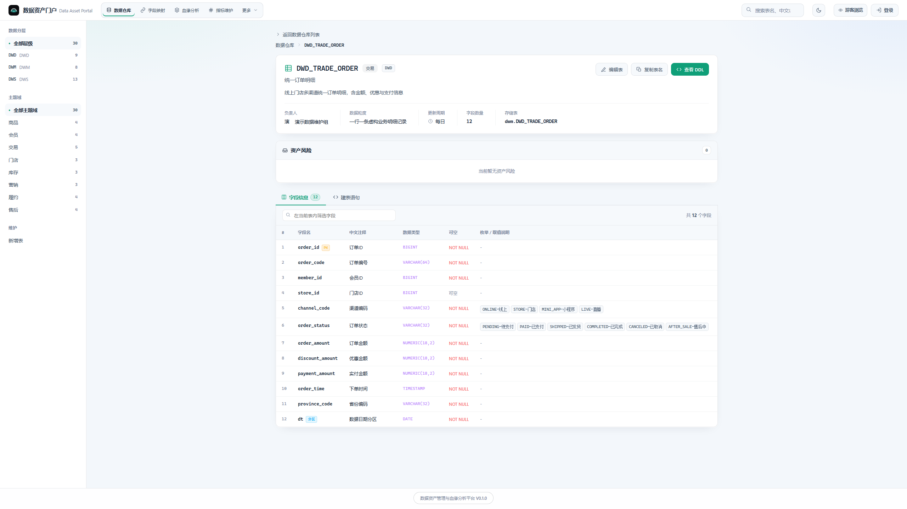
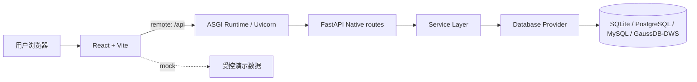

<div align="center">

# 数据资产门户

**一个轻量的数据仓库元数据管理门户 —— 让数据资产可见、可查、可维护。**

A lightweight metadata management portal for data warehouses: browse table assets,
trace field/table mappings, and maintain roots, indicators, and downstream metadata.

[](./LICENSE)
[](https://github.com/0verme/data-asset-portal-community/actions/workflows/ci.yml)


[快速开始](#-快速开始) · [社区入口](#-社区入口) · [功能模块](#-功能模块) · [文档](#-文档导航)

</div>

---

## 💡 这是什么

数据团队经常需要回答：**表在哪、字段是什么意思、口径从哪里来、数据流向哪里？**
数据资产门户把这些元数据集中到一个可搜索、可维护的界面中，服务于数仓建模、数据治理和 BI 支撑团队。

它专注于**元数据可见、可查、可维护**，不是调度执行平台：不负责真实采集、任务编排或文件推送执行。

## 📸 项目预览

以下截图来自仓库内 `demo/datasets/` 的虚构零售数据，展示真实的 DB → Service → API → Frontend 链路：

<table>
  <tr>
    <td width="50%" valign="top" align="center">
      
      <br><sub><b>资产搜索与发现</b></sub>
    </td>
    <td width="50%" valign="top" align="center">
      
      <br><sub><b>数据资产管理</b></sub>
    </td>
  </tr>
  <tr>
    <td width="50%" valign="top" align="center">
      
      <br><sub><b>字段映射</b></sub>
    </td>
    <td width="50%" valign="top" align="center">
      
      <br><sub><b>资产详情</b></sub>
    </td>
  </tr>
</table>

更多页面见 [截图画廊](./docs/screenshots.md)。

## 🧭 Runtime Truth

- **Frontend**：React + Vite。
- **Backend**：FastAPI Native，由 Uvicorn 加载 `backend/asgi.py`。
- **Production / local entrypoint**：`uvicorn backend.asgi:app --host 127.0.0.1 --port 5099`。
- **Health contract**：`/healthz` 返回 `runtime=fastapi`、`fastapiPrimary=true`、`flaskFallback=false`；其中 `flaskFallback` 是明确的回归字段，不表示仓库仍运行 Flask。
- **Data path**：Application / Service Layer → Database Provider → SQLite、PostgreSQL、MySQL 或 GaussDB/DWS。

## 🚀 快速开始

### Repository Community Demo（真实 remote API，推荐首次体验）

需要 Python 3.10+、Node.js 22.13+ 和 npm 10+。`scripts/community_demo.py` 会在项目目录内准备后端 virtualenv、前端依赖、SQLite、Alembic migration、完整 repository seed，并以 `backend/asgi.py` + Uvicorn 启动真实 FastAPI API 与前端。它与前端 mock 共享仓库模块集合；数据来源、storage profile 和线上静态 Demo revision 可以不同，但不会因 profile 隐藏仓库模块。

Linux/macOS：

```bash
git clone https://github.com/0verme/data-asset-portal-community.git
cd data-asset-portal-community
./scripts/demo.sh
```

Windows PowerShell：

```powershell
git clone https://github.com/0verme/data-asset-portal-community.git
cd data-asset-portal-community
.\scripts\demo.ps1
```

启动后按终端输出打开 Demo URL，使用账号 `community_demo / demo-change-me` 登录。
初始化但不启动服务时，使用 `./scripts/demo.sh --init-only` 或
`.\scripts\demo.ps1 -InitOnly`。详细说明见 [Community Demo 指南](./docs/community-demo.md)。

### 只看前端（mock mode）

只需 Node.js 22.13+ 和 npm 10+；mock mode 只读取前端受控数据，不需要数据库或后端服务。默认 module registry 与 remote backend 采用同一 open repository module contract；数据、外部依赖和 storage readiness 仍可不同。

```bash
npm --prefix frontend ci
cp frontend/.env.example frontend/.env.local
npm --prefix frontend run dev
```

确认 `frontend/.env.local` 中为 `VITE_API_MODE=mock` 后，使用公开演示账号 `admin` / `community-demo-password` 登录（仅 mock 模式；可用 `VITE_MOCK_AUTH_*` 覆盖）。
mock 数据只用于前端体验，不会写入数据库。

### 在线静态 Demo

[https://data.overme.cn/](https://data.overme.cn/) 是独立部署的静态/mock bundle。当前可见 footer 为 `V1.0.0`，其数据、版本和部署 revision 独立于仓库；它与仓库 mock/remote Demo 共享“仓库模块默认开放”的解释，但不自动等同于当前 `origin/main` 或已发布 GitHub Release。

## 🤝 社区入口

- **使用项目** → [文档导航](#-文档导航) 和 [Community Demo 指南](./docs/community-demo.md)
- **有问题** → [GitHub Discussions · Q&A](https://github.com/0verme/data-asset-portal-community/discussions/categories/q-a)
- **发现 Bug** → [Bug Report Issue Form](https://github.com/0verme/data-asset-portal-community/issues/new?template=bug_report.yml)
- **想参与贡献** → [Good First Issues](https://github.com/0verme/data-asset-portal-community/issues?q=is%3Aissue+is%3Aopen+label%3A%22good+first+issue%22) · [CONTRIBUTING.md](./CONTRIBUTING.md)
- **安全问题** → 阅读 [SECURITY.md](./SECURITY.md)，通过 GitHub Private Vulnerability Reporting 私密提交；不要发到公开 Issue 或 Discussion。

## 🧩 功能模块

仓库中已有的 Apache-2.0 模块默认属于同一 open module set：

- **门户首页、数据仓库、字段映射、血缘分析**：浏览资产、映射关系和血缘快照。
- **上游卸数、下游推送、报表资产、码值表维护**：维护外部数据源、推送元数据、报表台账和码值表元数据。
- **词根、指标、API 资产、系统管理**：维护命名、指标口径、API 元数据以及用户/菜单/参数字典/操作日志。
- **统一搜索与门户统计**：为所有已注册搜索实体和统计 provider 提供聚合入口。

所有模块默认注册 route、进入 capability response、进入 canonical schema/seed；管理员仍可通过 `p_menu.status` 配置单个实例的菜单可见性。需要数据库驱动、凭据、外部系统、持久化 lineage storage 或危险写操作时，系统会报告真实 deployment capability 状态，而不是隐藏源码模块。

完整的 Source / Runtime / Schema / Demo 对照见 [docs/modules.md](./docs/modules.md)。

> **许可、仓库模块和部署能力是三个独立概念：**本仓库包含的源码均按 Apache-2.0 License 提供。
> 外部 Collector、Adapter、Integration、凭据和生产连接属于部署/集成能力；它们未配置时不改变模块的存在性。

## 🏗 架构概览



默认由 Uvicorn 加载 `backend/asgi.py`；FastAPI 是唯一 production runtime。所有仓库模块 route 与 infrastructure route 由 FastAPI 处理；缺少数据库、驱动、凭据或外部集成时，Service Layer 返回已有的诊断错误契约，而不是因产品 profile 返回 404。所有 API 复用同一 Service Layer、API Contract 和 Database Provider。外部元数据通过稳定的 `Metadata Contract` 接入 `/api/metadata`，Collector 不需要知道 DAP 内部 schema；前端通过 `VITE_API_MODE` 选择 mock 或 remote，后端按 database profile 访问数据库。

外部接入链路为 `Customer System → Collector / Adapter → Versioned Metadata Contract → DAP Metadata API`。DAP 负责 Receive、Validate、Normalize、Persist、Audit、Expose；Collector 负责 source access、parse、schedule 和 retry。详见 [Metadata Ingestion Contract](./docs/metadata-ingestion.md) 和 [ADR-001](./docs/adr/001-metadata-ingestion-contract.md)。

新安装和既有数据库升级都以 `backend/schema` 四方言完整 baseline + `backend/alembic` 增量 revision 为唯一结构契约，随后使用对应的 `demo/seed_sqlite.py` 或 `demo/seed_postgres.py` 写入完全虚构数据。`docs/pg/` 与 `docs/dws/` 保留为方言参考和部署说明，不再代表隐藏模块的物理边界。
详见 [架构说明](./docs/architecture.md)、[数据库迁移说明](./backend/schema/README.md) 和 [部署说明](./DEPLOYMENT.md)。

## 🏷️ Release / Version Truth

- **Published GitHub Release**：`v0.1.0`；对应历史章节见 [CHANGELOG.md](./CHANGELOG.md)，不会被本 PR 改写。
- **Draft Release**：`v0.1.1` 仍是 Draft，不是 published release。
- **Current main**：当前 `origin/main` 是 `v0.1.0` 之后的 unreleased development state。
- **Application/package metadata**：FastAPI app、frontend package 和仓库本地 footer 仍使用 `0.1.0` / `V0.1.0`，不表示已经发布新版本。
- **Online Demo build**：线上静态/mock bundle 的 `V1.0.0` 是独立 build metadata，不代表仓库 release 或当前 main。

## 📚 文档导航

| 文档 | 内容 |
| ------ | ------ |
| [Community Demo](./docs/community-demo.md) | SQLite / PostgreSQL 多步骤演示数据初始化 |
| [首次贡献指南](./docs/first-contribution.md) | Fork、分支、测试和 PR walkthrough |
| [Good First Issue 提案](./docs/good-first-issues.md) | 已审计的 contributor-friendly backlog 提案 |
| [贡献指南](./CONTRIBUTING.md) | Issue、PR、代码风格和标签语义 |
| [开发指南](./DEVELOPMENT.md) | 环境变量、本地开发与测试矩阵 |
| [部署说明](./DEPLOYMENT.md) | 构建、Nginx 反代和部署注意事项 |
| [架构说明](./docs/architecture.md) | 前后端架构、数据流和数据库边界 |
| [模块清单](./docs/modules.md) | 页面、接口入口和数据表对照 |
| [API 契约](./docs/api-contract.md) | API 约定、端点和请求/响应模型 |
| [Metadata Ingestion Contract](./docs/metadata-ingestion.md) | 外部 Collector 接入、版本、幂等、血缘 snapshot 与示例 |
| [ADR-001](./docs/adr/001-metadata-ingestion-contract.md) | Metadata Contract 架构决策记录 |
| [数据库迁移](./backend/schema/README.md) | Alembic baseline、stamp 与 forward migration 运维规则 |
| [截图画廊](./docs/screenshots.md) | Community Demo 全量界面截图 |
| [资产风险联动设计](./docs/asset-risk-integration-design.md) | 外部审计结果接入边界与提案 |
| [智能问数与语义推荐](./docs/semantic-recommendation-roadmap.md) | 问数底座与语义推荐路线 |
| [待确认事项](./docs/todo.md) | 当前尚未完成或待决策事项 |
| [更新日志](./CHANGELOG.md) | 阶段性变更 |

## ❓ 常见问题

### 支持哪些数据库？

SQLite 用于 Community 本地演示、开发和 CI；PostgreSQL 用于 Community 与完整部署；MySQL 8.0 通过独立 profile/driver 进行数据库契约验证；GaussDB / DWS
用于完整部署场景。当前不支持 Cloudflare D1。验证范围和初始化命令见 [开发指南](./DEVELOPMENT.md)。

### mock 和 remote 有什么区别？

`VITE_API_MODE=mock` 只读取前端内置数据，使用公开演示账号 `admin` / `community-demo-password` 登录；`remote` 通过 `/api`
访问后端真实数据库，需要先按 [Community Demo](./docs/community-demo.md) 或 [开发指南](./DEVELOPMENT.md) 配置。

### 这个项目负责真实数据采集吗？

不负责 source-specific 采集和调度。DAP 提供稳定的 Metadata Ingestion Contract/API，接收 Collector 已解析的资产和 lineage snapshot；采集连接、parser、调度、失败重试和真实文件推送仍属于外部 Collector / Adapter 或独立集成项目。

## 🗺 路线图

当前版本不包含以下能力，欢迎先在 Discussions 讨论设计，再提交有边界的 Issue：

- 真实采集调度、任务编排和失败重试
- 真实下游文件推送执行链路
- 细粒度 RBAC、多角色权限体系和完整审计中心
- DAP Core 内置万能 parser、自动血缘解析与自动元数据采集；外部 Collector Contract 已提供接入边界

阶段更新见 [CHANGELOG.md](./CHANGELOG.md)，待确认事项见 [docs/todo.md](./docs/todo.md)。

## 🤝 贡献

欢迎从 [Good First Issues](https://github.com/0verme/data-asset-portal-community/issues?q=is%3Aissue+is%3Aopen+label%3A%22good+first+issue%22) 开始，
并阅读 [首次贡献指南](./docs/first-contribution.md) 与 [CONTRIBUTING.md](./CONTRIBUTING.md)。

## 📄 许可证

本项目基于 [Apache License 2.0](./LICENSE) 开源。第三方归属说明见 [NOTICE](./NOTICE)。

---

## License

Licensed under the Apache License, Version 2.0. See the [LICENSE](./LICENSE) file for the full license text,
and [NOTICE](./NOTICE) for attribution notices.

Copyright 2025 Jearhe (overme.cn)
