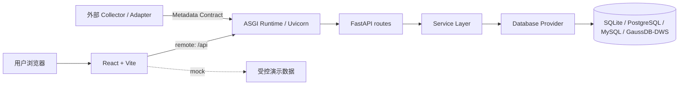

<div align="center">

# 数据资产门户 · Data Asset Portal

**面向数据仓库团队的轻量数据资产目录 —— 内网、离线、单机也能跑。**

A lightweight, intranet-friendly data asset catalog for data warehouse teams.

[](./LICENSE)
[](https://github.com/0verme/data-asset-portal-community/actions/workflows/ci.yml)


[快速开始](#-快速开始) · [为什么选 DAP](#-为什么选-dap) · [与 OpenMetadata 的差异](#-与-openmetadata-和-datahub-的定位差异) · [功能](#-功能) · [数据库兼容性](#-数据库兼容性) · [文档](#-文档导航)

</div>

---

## 💡 DAP 是什么

数据团队经常需要回答：**表在哪、字段是什么意思、口径从哪里来、数据流向哪里？**

DAP 把这些元数据集中到一个可搜索、可维护的界面里，服务于数仓建模、数据治理和 BI 支撑团队。
它的产品目标是**让数仓资产可见、可查、可维护**——是一个资产目录，不是一个大而全的元数据平台，也不是调度执行平台。

一句话概括它的取舍：

> **DAP 只做「数仓资产目录」这一件事，并且尽量让它能在内网的一台机器上跑起来。**

### 它明确不做

- 不负责真实数据采集、任务编排或文件推送执行
- 不内置 SQL / DAG / 调度系统的自动血缘解析
- 不提供数据质量、Profiling、数据合约与治理工作流
- 不提供开箱即用的数百个数据源 connector

如果你需要的正是上面这些，请先读 [与 OpenMetadata 和 DataHub 的定位差异](#-与-openmetadata-和-datahub-的定位差异)。

## 📸 项目预览

以下截图来自仓库内 `demo/datasets/` 的虚构零售数据，展示真实的 DB → Service → API → Frontend 链路：

<table>
  <tr>
    <td width="50%" valign="top" align="center">
      
      <br><sub><b>资产搜索与发现</b></sub>
    </td>
    <td width="50%" valign="top" align="center">
      
      <br><sub><b>数据资产管理</b></sub>
    </td>
  </tr>
  <tr>
    <td width="50%" valign="top" align="center">
      
      <br><sub><b>字段映射</b></sub>
    </td>
    <td width="50%" valign="top" align="center">
      
      <br><sub><b>资产详情</b></sub>
    </td>
  </tr>
</table>

更多页面见 [截图画廊](./docs/screenshots.md)。

## 🎯 为什么选 DAP

DAP 面向的是**没有精力、也没有条件部署一整套元数据平台**的团队：

| 场景 | DAP 的适配点 |
| --- | --- |
| 小团队 / 独立数仓团队 | 一个 Web 端 + 一个数据库即可上线，不需要消息中间件或独立搜索引擎 |
| 内网 / 离线环境 | 支持完全离线的内网单机部署（systemd + Nginx，见 [部署说明](./DEPLOYMENT.md)） |
| 以数仓为中心的元数据 | 表、字段、DDL、指标口径、词根、字段映射、上下游、报表、API 资产都是一等公民 |
| 中国企业常见数据库环境 | PostgreSQL、MySQL 8.0、GaussDB / DWS 均有适配；SQLite 可用于本地与 CI |
| 已有采集能力，只缺一个目录 | 外部 Collector 通过版本化 [Metadata Ingestion Contract](./docs/metadata-ingestion.md) 接入，DAP 不侵入你的采集链路 |
| 需要移动端查阅 | 提供微信小程序只读资产目录 MVP，见 [miniapp/](./miniapp/README.md) |

## 🪶 与 OpenMetadata 和 DataHub 的定位差异

**DAP 不试图替代 OpenMetadata、DataHub 或 Apache Atlas。**

这三个项目是成熟的企业级元数据平台，覆盖了 DAP 明确不做的领域：数百个开箱即用的 connector、
内置采集与调度、自动血缘解析、数据质量与 Profiling、治理工作流。

> 如果你需要这些能力，OpenMetadata 或 DataHub 很可能是更合适的选择。
> 这是**定位差异**，不是能力高低。

DAP 只在一个更窄的范围里做取舍：**用更少的组件、更低的运维成本，交付一个数仓资产目录。**

### 定位对比

> 下表是**产品定位对比**，不是性能 benchmark，也不用于评判项目优劣。
> 各项目的具体能力以其官方文档与版本为准。

| 维度 | DAP | OpenMetadata | DataHub |
| --- | --- | --- | --- |
| 主要目标 | 轻量数仓资产目录 | 统一元数据平台（含治理闭环） | 企业级元数据平台 |
| 部署形态 | Web 端 + 单个数据库，可单机内网部署 | 多服务：元数据服务 + ingestion + 索引/存储依赖 | 多组件：元数据服务 + 消息/索引/存储依赖 |
| 运维复杂度 | 低 | 中高 | 中高 |
| 数仓为中心 | 是（核心范围） | 是，但覆盖范围更广 | 是，但覆盖范围更广 |
| 离线 / 内网单机部署 | 重点支持的场景 | 可行，但依赖组件更多 | 可行，但依赖组件更多 |
| 内置 connector 生态 | 不提供 | 丰富 | 丰富 |
| 内置自动采集与调度 | 不提供 | 提供 | 提供 |
| 自动血缘解析 | 不提供，只展示导入的血缘 | 提供 | 提供 |
| 数据质量 / Profiling | 不提供 | 提供 | 提供（随版本与配置） |
| 治理广度 | 资产目录 + permission RBAC + 操作日志 | 目录 + 质量 + 血缘 + 词汇表 + 策略 | 目录 + 血缘 + 策略与元数据自动化 |
| 外部 Collector 接入模型 | 核心集成方式，版本化契约 | 支持，但更强调内置 ingestion | 支持，但更强调内置 ingestion |
| 微信小程序只读目录 | 提供（MVP） | 未提供 | 未提供 |
| 小团队友好度 | 高 | 需要更多运维投入 | 需要更多运维投入 |

Apache Atlas 主要面向 Hadoop 生态的元数据与治理（Hive、HDFS 等），依赖 HBase / Solr 等组件，
与 DAP 的目标场景（关系型数仓 + 轻量内网部署）重叠更少，因此未列入上表。

## 🧩 功能

仓库中的模块全部以 Apache-2.0 开源，默认注册、默认可用：

- **门户首页、数据仓库、字段映射、血缘浏览**：浏览资产、映射关系和已导入的血缘快照。
- **上游卸数、下游推送、报表资产、码值表维护**：维护外部数据源、推送元数据、报表台账和码值表元数据。
- **词根、指标、API 资产、系统管理**：维护命名规范、指标口径、API 元数据以及用户/菜单/参数字典/操作日志。
- **Permission-based RBAC**：后端按 permission code 强制授权，支持角色、权限映射、角色管理和单角色用户绑定。
- **统一搜索与门户统计**：为所有已注册搜索实体和统计 provider 提供聚合入口。
- **微信小程序只读目录**：匿名只读浏览资产、指标、字段与搜索结果。

完整的页面 / 接口 / 数据表对照见 [模块清单](./docs/modules.md)。

## 🏗 架构概览



| 部件 | 说明 |
| --- | --- |
| 前端 | React 18 + Vite 8，现有代码以 JS/JSX 为主，新增边界代码采用 TypeScript |
| 后端 | FastAPI + Uvicorn，入口 `backend/asgi.py` |
| Production / local entrypoint | `uvicorn backend.asgi:app --host 127.0.0.1 --port 5099` |
| 健康检查 | `GET /healthz`，只报告进程状态，不查询数据库 |
| 数据访问 | Service Layer → Database Provider → SQLite / PostgreSQL / MySQL / GaussDB-DWS |
| 部署 | Nginx 托管前端静态资源并反代 `/api`，见 [部署说明](./DEPLOYMENT.md) |

外部元数据的接入链路是 `业务系统 → Collector / Adapter → 版本化 Metadata Contract → DAP Metadata API`：
DAP 负责接收、校验、归一化、持久化、审计与发布；**采集连接、解析、调度和重试属于外部 Collector**。
详见 [Metadata Ingestion Contract](./docs/metadata-ingestion.md) 与 [ADR-001](./docs/adr/001-metadata-ingestion-contract.md)。

技术栈与架构边界的完整说明见 [架构说明](./docs/architecture.md)。

## 🗄 数据库兼容性

DAP 用两个标签描述数据库支持程度：

- **Verified** —— 有可复现的自动化测试或 CI job 覆盖（包含真实数据库实例或受支持的本地路径）。
- **Compatible** —— 代码与 DDL 层面提供适配，但只有静态 / 离线验证，没有在线 CI 或真实实例回归。

| 数据库 | Runtime | Migration | CI 验证 | 说明 |
| --- | --- | --- | --- | --- |
| SQLite | Verified | Verified | Verified | Community 本地开发、一键 Demo 与部分 CI 的默认数据库；**不是生产目标** |
| PostgreSQL | Verified | Verified | Verified（真实 PG 16 实例） | fresh apply → seed → 全量后端集成测试 → repeat apply no-op |
| MySQL 8.0 | Verified | Verified | Verified（真实 MySQL 8 实例） | baseline apply / verify + SQLAlchemy Core CRUD、分页、唯一约束、Unicode、NULL、rollback 契约 + repeat apply no-op |
| GaussDB / DWS | Compatible | Compatible（offline/static DDL） | **Static verification only** | 仅执行 `schema_migrate.py verify --offline --dialect dws`；没有在线 CI 实例与端到端回归；JDBC 驱动由部署方自备 |
| Cloudflare D1 | 不支持 | — | — | 无 adapter，也没有支持计划 |

完整矩阵、验证命令与边界说明见 [数据库支持矩阵](./docs/database-support.md)。

## 🚀 快速开始

### Repository Community Demo（真实 remote API，推荐首次体验）

需要 Python 3.10+、Node.js 22.13+ 和 npm 10+。执行以下一键命令后，按终端输出打开 Demo。

Linux/macOS：

```bash
./scripts/demo.sh
```

Windows PowerShell：

```powershell
.\scripts\demo.ps1
```

详细说明见 [Community Demo 指南](./docs/community-demo.md)。

### 只看前端（mock mode）

只需 Node.js 22.13+ 和 npm 10+。mock mode 只读取前端受控数据，不需要数据库或后端服务。

```bash
npm --prefix frontend ci
cp frontend/.env.example frontend/.env.local
npm --prefix frontend run dev
```

确认 `frontend/.env.local` 中为 `VITE_API_MODE=mock` 后，使用公开演示账号 `admin` / `community-demo-password` 登录
（仅 mock 模式有效；可用 `VITE_MOCK_AUTH_*` 覆盖）。mock 数据不会写入数据库。

### 在线静态 Demo

[https://data.overme.cn/](https://data.overme.cn/) 是独立部署的静态 mock bundle，用于快速预览界面。
它的版本、数据和部署 revision 独立于本仓库，不代表当前 `origin/main` 或已发布的 Release。

## 🤝 社区入口

- **使用项目** → [文档导航](#-文档导航) 和 [Community Demo 指南](./docs/community-demo.md)
- **有问题** → [GitHub Discussions · Q&A](https://github.com/0verme/data-asset-portal-community/discussions/categories/q-a)
- **发现 Bug** → [Bug Report Issue Form](https://github.com/0verme/data-asset-portal-community/issues/new?template=bug_report.yml)
- **想参与贡献** → [Good First Issues](https://github.com/0verme/data-asset-portal-community/issues?q=is%3Aissue+is%3Aopen+label%3A%22good+first+issue%22) · [CONTRIBUTING.md](./CONTRIBUTING.md)
- **安全问题** → 阅读 [SECURITY.md](./SECURITY.md)，通过 GitHub Private Vulnerability Reporting 私密提交；不要发到公开 Issue 或 Discussion。

## 🔌 元数据接入 Metadata Ingestion

DAP Core 不直接连接业务库做采集。外部系统通过版本化契约把元数据推给 DAP：

```text
Customer System → Collector / Adapter → Versioned Metadata Contract → DAP Metadata API
```

- **Collector 负责**：source access、parse、schedule、retry。
- **DAP 负责**：Receive、Validate、Normalize、Persist、Audit、Expose。

Collector 不需要了解 DAP 的内部 schema。示例见 `examples/metadata_ingestion/`，
完整字段与语义见 [Metadata Ingestion Contract](./docs/metadata-ingestion.md)。

## 🔍 血缘浏览 Lineage

**DAP Core 不自动解析 SQL、DAG 或调度系统来生成血缘。**

页面上的血缘来自**已导入的血缘快照（imported lineage snapshot）**，来源有两种：

1. 外部 Collector / Adapter 通过 [Metadata Ingestion Contract](./docs/metadata-ingestion.md) 推送；
2. 使用 `backend/scripts/collect_lineage_snapshot.py` 手工导入（见 [血缘快照采集与发布指南](./docs/lineage_bulk_import_guide.md)）。

因此这个能力的准确定位是**血缘浏览 / 血缘视图（Lineage Viewer）**：查询、过滤和展示已经导入的血缘关系，
而不是血缘分析引擎。UI 中该模块的中文名称保留为「血缘分析」，指的就是这个浏览功能。

V1 血缘只支持 self-contained `replace` snapshot：新快照先以 `INACTIVE` 写入，节点/边校验通过后在同一事务内切换为 `ACTIVE`。

## 📱 微信小程序

仓库提供独立的 [Data Asset Portal Pocket 小程序 MVP](./miniapp/README.md)，位于根目录 `miniapp/`，
使用 Taro 4 + React + TypeScript，面向微信小程序 `weapp`，当前提供**匿名只读**的资产目录浏览体验。

### API 安全边界

- **Public Catalog**：普通业务目录、搜索、字段/DDL、映射、血缘、菜单、报表、API 资产、码值表、上/下游目录和门户统计支持匿名只读浏览；公开响应按需脱敏，不是全部 GET 无脑公开。
- **Authenticated Management**：写操作、管理操作和敏感读取继续由 permission-based RBAC 控制。
- **Protected data**：系统用户/角色/参数、操作日志、Metadata ingestion、上/下游 `admin-detail`、连接信息、凭据和认证信息继续要求认证/权限。

完整 route 分类见 [Public Catalog + Authenticated Management](./docs/rbac/authenticated-read-model.md)。

## 📚 文档导航

### 使用与部署

| 文档 | 内容 |
| ------ | ------ |
| [Community Demo 指南](./docs/community-demo.md) | SQLite / PostgreSQL 多步骤演示数据初始化 |
| [数据库支持矩阵](./docs/database-support.md) | Verified / Compatible 分层与验证边界 |
| [部署说明](./DEPLOYMENT.md) | Linux 单机部署、systemd、Nginx、HTTPS 与验收 |
| [开发指南](./DEVELOPMENT.md) | 环境变量、本地开发与测试矩阵 |
| [架构说明](./docs/architecture.md) | 前后端架构、数据流和数据库边界 |
| [模块清单](./docs/modules.md) | 页面、接口入口和数据表对照 |
| [API 契约](./docs/api-contract.md) | API 约定、端点和请求/响应模型 |
| [Metadata Ingestion Contract](./docs/metadata-ingestion.md) | 外部 Collector 接入、版本、幂等、血缘 snapshot 与示例 |
| [ADR-001](./docs/adr/001-metadata-ingestion-contract.md) | Metadata Contract 架构决策记录 |
| [数据库迁移](./backend/schema/README.md) | Alembic baseline、stamp 与 forward migration 运维规则 |
| [截图画廊](./docs/screenshots.md) | Community Demo 全量界面截图 |

### 设计与规划

| 文档 | 内容 |
| ------ | ------ |
| [资产风险联动设计](./docs/asset-risk-integration-design.md) | 外部审计结果接入边界与提案 |
| [智能问数与语义推荐](./docs/semantic-recommendation-roadmap.md) | 问数底座与语义推荐路线 |
| [待确认事项](./docs/todo.md) | 当前尚未完成或待决策事项 |
| [更新日志](./CHANGELOG.md) | 阶段性变更 |

### 参与贡献

| 文档 | 内容 |
| ------ | ------ |
| [首次贡献指南](./docs/first-contribution.md) | Fork、分支、测试和 PR walkthrough |
| [Good First Issue 提案](./docs/good-first-issues.md) | 已审计的 contributor-friendly backlog 提案 |
| [贡献指南](./CONTRIBUTING.md) | Issue、PR、代码风格和标签语义 |
| [工程历史归档](./docs/archive/engineering-history/README.md) | 已完成迁移阶段的工程记录，仅供维护者追溯 |

## 🗺 路线图与明确不做的事

以下内容**当前明确不做**。欢迎先在 Discussions 讨论设计，再提交有边界的 Issue：

- 自动 SQL / DAG / 调度血缘解析（血缘继续走导入式契约）
- 内置采集调度、任务编排和失败重试
- 真实下游文件推送执行链路
- 数据质量、Profiling、数据合约与治理工作流
- OpenMetadata / DataHub 量级的 connector 生态
- 多角色绑定、ABAC/ACL、数据范围（row-level/data-scope）授权、SSO/外部 IAM
- 向量检索、Embedding 与 LLM 语义推荐（路线见 [语义推荐 roadmap](./docs/semantic-recommendation-roadmap.md)）

阶段更新见 [CHANGELOG.md](./CHANGELOG.md)，待确认事项见 [docs/todo.md](./docs/todo.md)。

## 🙋 常见问题

### 支持哪些数据库？

SQLite（本地 / Demo / CI）、PostgreSQL、MySQL 8.0 为 **Verified**；GaussDB / DWS 为 **Compatible**，
只有离线静态验证。完整矩阵见 [数据库支持矩阵](./docs/database-support.md)。

### mock 和 remote 有什么区别？

`VITE_API_MODE=mock` 只读取前端内置数据，使用公开演示账号 `admin` / `community-demo-password` 登录；
`remote` 通过 `/api` 访问后端真实数据库，需要先按 [Community Demo](./docs/community-demo.md) 或 [开发指南](./DEVELOPMENT.md) 配置。

### 这个项目负责真实数据采集吗？

不负责 source-specific 采集和调度。DAP 提供稳定的 Metadata Ingestion Contract / API，接收 Collector 已解析的资产和血缘 snapshot；
采集连接、解析、调度、失败重试和真实文件推送仍属于外部 Collector / Adapter 或独立集成项目。

### 它和 OpenMetadata / DataHub 是什么关系？

不是替代关系。DAP 是更轻量的数仓资产目录，面向内网 / 离线 / 小团队；
如果需要完整元数据平台能力，应优先评估 OpenMetadata 或 DataHub。详见[定位对比](#-与-openmetadata-和-datahub-的定位差异)。

## 🤝 贡献

欢迎从 [Good First Issues](https://github.com/0verme/data-asset-portal-community/issues?q=is%3Aissue+is%3Aopen+label%3A%22good+first+issue%22) 开始，
并阅读 [首次贡献指南](./docs/first-contribution.md) 与 [CONTRIBUTING.md](./CONTRIBUTING.md)。

## 📄 许可证

本项目基于 [Apache License 2.0](./LICENSE) 开源。第三方归属说明见 [NOTICE](./NOTICE)。

---

## License

Licensed under the Apache License, Version 2.0. See the [LICENSE](./LICENSE) file for the full license text,
and [NOTICE](./NOTICE) for attribution notices.

Copyright 2025 Jearhe (overme.cn)
