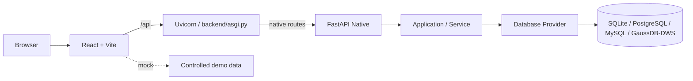

# 架构说明

## Runtime Truth

当前后端是纯 FastAPI ASGI 运行时：

```text
Uvicorn
  ↓
backend/asgi.py
  ↓
FastAPI Native
  ↓
Application / Service
  ↓
Database Provider
```

生产和默认开发入口均为：

```bash
uvicorn backend.asgi:app --host 127.0.0.1 --port 5099
```

`backend/run.py`、Waitress、WSGI fallback 和 runtime switch 均已退休；当前没有第二套 Flask runtime。`GET /healthz` 只报告进程状态，固定返回 `runtime=fastapi`、`fastapiPrimary=true`、`flaskFallback=false`，不执行数据库查询。`flaskFallback` 是显式的回归字段，不是当前架构节点。

## 请求分发



`backend/app/fastapi/app.py` 根据 capability map 注册 native routers；`backend/asgi.py` 只负责 FastAPI composition、CORS/security headers 和 healthz。WAIT_DB/Private routes 不注册，不通过第二套 runtime 承载。

### FastAPI current route surface

当前 FastAPI adapter 负责下列 native routes；带 `*` 的模块源码与 adapter 已存在，但仍受当前 profile / capability 控制，Community 默认不会注册：

- Indicator：`/api/indicators`
- Assets / DWM：`/api/assets`
- Field Mapping：`/api/field-mappings`
- Root：`/api/roots`
- Manual Code Table*：`/api/manual-code-tables`
- Report*：`/api/reports`
- API Asset：`/api/api-assets`
- Lineage：`/api/lineage`
- Auth：`/api/auth`（native signed-session adapter）
- Capabilities：`/api/capabilities`（native infrastructure adapter）
- Portal Stats：`/api/portal/stats`（native infrastructure adapter）
- Unified Search：`/api/search`（native infrastructure adapter）
- System Management：`/api/system`
- Operation Log：`/api/operation-logs`
- Upstream*：`/api/upstreams`

模块级 parity 和 migration 状态见 [FastAPI P4 Migration Matrix](./fastapi-p4-migration-matrix.md)。

### Scope exclusions

以下路径在 Community Native runtime 中按 gate 不注册：

- Common Code：`/api/common-codes/*`（WAIT_DB）
- Indicator Path、Common Code、Push（WAIT_DB/Private boundary）
- 任何未注册的请求返回 FastAPI `NOT_FOUND` envelope

Community profile 的 disabled/private 路径不会因为 runtime 收口而意外暴露。

## Application Boundary

HTTP adapter 只负责请求解析、认证依赖、contract validation、response envelope 和 adapter-specific error mapping：

```text
FastAPI adapter ── Application / Service Layer ── Database Provider ── Database
```

`backend/app/contracts/` 是框架中立的 API Contract，由 FastAPI native adapter 复用；Service、Contract 和 Database Layer 不因 runtime retirement 复制业务逻辑。

- `backend/asgi.py` 负责纯 FastAPI composition、CORS/security headers、native signed-session identity resolver 和 healthz。
- `backend/app/fastapi_app.py` 是保留历史 import path 的 thin compatibility facade。
- `backend/app/fastapi/app.py` 负责 FastAPI app bootstrap、explicit Service injection、capability gate 与 Router registration；`dependencies.py`、`errors.py` 和 `routers/` 承载共享 adapter seam 与模块边界。
- `backend/app/__init__.py` 仅保留 production composition 说明；历史 Flask factory/blueprint 已删除，native package import 不加载 Flask。
- `backend/app/services/` 和 `backend/app/db/` 是 FastAPI native 复用的业务与数据库边界。

## Rollback

F6 不再提供 Flask runtime rollback switch。应用回滚通过部署上一版已验证的 Git commit/image 完成；不回滚数据库 schema、migration、Service 或 API Contract。`uvicorn backend.asgi:app` 是唯一当前推荐入口。

## Transitional Debt

### F7 cleanup result

F5 gate 已证明 production native composition 不加载 Flask；F7 已删除 Flask/Flask-Cors dependencies、Flask factory/blueprints/routes 与 obsolete compatibility tests。保留的 `Werkzeug`、`itsdangerous`、signed-cookie config names 和薄 `fastapi_app.py` facade 均有明确 native reason。当前生成的 architecture artifact 以可审计 source revision 为证据；历史 migration notes 中的旧图示不应被当作 current runtime truth。

## 前端与数据层

- `frontend/src/App.jsx` 负责应用编排、登录态和模块路由；`frontend/src/api/` 统一访问 `/api`。
- `VITE_API_MODE=mock` 使用受控前端演示数据；`remote` 访问真实后端数据库。两种模式默认使用同一仓库模块集合，数据和外部执行能力可以不同。
- Schema Source of Truth 是 `backend/schema` 四方言完整 baseline 加 `backend/alembic` 增量 revision；`demo/seed_*.py` 负责完整仓库模块的虚构演示数据。
- `backend/app/db/` 隔离 SQLite、PostgreSQL、MySQL 和 GaussDB/DWS 的 Provider 差异；数据库 profile 只表达部署连接能力。`docs/pg/`、`docs/dws/` 是方言参考和部署说明，不再作为隐藏模块的 schema 边界。
- 正式部署由 Nginx 托管前端静态资源，并将 `/api` 代理到 ASGI runtime；详细环境变量、health check 与 Nginx 配置见 [DEPLOYMENT.md](../DEPLOYMENT.md)。

## 当前边界与后续 Issue

仓库已有模块均默认进入统一的 route、capability、schema、seed、search 和 portal statistics contract。`backend/configs/community.yaml` 仅保留本地演示的数据库/feature profile；`p_menu.status` 仍是实例级可见性配置。WAIT_DB 或外部存储/驱动未配置时，模块 route 仍存在，由现有 Service error contract 返回可诊断状态。
