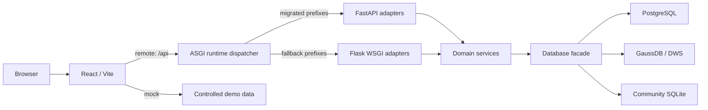

# 架构说明

## 总体结构

项目是前后端分离的模块化单体：React + Vite 提供单页应用，ASGI runtime 以 FastAPI 作为已迁移 API 的 primary，并将未迁移 API 委托给 Flask WSGI fallback；服务层通过数据库 Adapter 访问元数据表。门户负责元数据维护和查询，不执行真实采集调度、任务编排或文件推送。

## 前端

- `frontend/src/App.jsx` 负责应用编排、登录态和模块路由。
- `frontend/src/modules/moduleRegistry.js` 是前端模块定义入口；业务页面按模块动态加载。
- `components/views/`、`components/sidebar/` 和 `hooks/` 分别承载视图、侧边栏和领域状态。
- `frontend/src/api/` 封装数据访问；`VITE_API_MODE=mock` 使用受控演示数据，`remote` 统一访问 `/api`。
- URL 解析集中在 `routing/location.js`，筛选、详情和视图状态支持刷新、分享及前进后退恢复。

当前共有 12 个一级功能模块：门户、上游卸数、数据仓库、字段映射、血缘分析、词根管理、指标维护、报表资产、API 资产、下游推送、码值表维护和系统管理。完整清单见 [modules.md](./modules.md)。

## 后端

- `backend/asgi.py` 是 P5 生产 runtime：FastAPI primary、Flask WSGI fallback、`/healthz` 与 runtime switch；`backend/run.py` 保留为直接 Flask fallback。
- `backend/app/__init__.py` 创建 Flask 实例，`backend/app/fastapi_app.py` 创建 opt-in FastAPI adapter app。
- `backend/app/core/modules.py` 定义模块、能力、版本边界和依赖；`blueprint_registry.py` 按启用模块注册蓝图。
- `routes/` 处理 HTTP 输入输出，`services/` 承载业务与数据库操作，`services/providers/` 注册搜索和门户统计能力。
- `db/facade.py` 提供统一访问门面，具体 Adapter 隔离 SQLite、PostgreSQL 和 GaussDB 差异。
- 业务写入与强制操作日志共享事务；认证等无法共享业务事务的辅助日志采用 best-effort 策略。

## 模块与版本边界

Community 和完整版复用同一模块注册机制，不维护第二套路由或搜索实现：

- Community 默认启用公共目录、资产、血缘、词根和指标等核心能力，可使用 SQLite 或 PostgreSQL。
- 完整部署可按需启用全部可选业务模块，正式部署使用 PostgreSQL 或 GaussDB/DWS。
- 字段映射使用公共逻辑数据源模型，不以 Upstream 作为运行依赖。
- API 资产使用公共业务系统模型，不以 Push 连接配置作为运行依赖。
- 关闭模块时，其蓝图、菜单、搜索 Provider 和门户统计 Provider 同步退出。

Cloudflare D1 不属于支持范围。SQLite 只用于 Community/local 隔离运行，不是完整版生产部署数据库。

## 数据库与迁移

- **Schema Source of Truth = `backend/schema` 完整基线 + `backend/alembic` 增量 revision**。
  Community 新安装的唯一官方初始化路径：`schema_migrate.py apply` → demo seed
  （SQLite 或 PostgreSQL）；完整版在此基础上由 `docs/{pg,dws}` 参考 DDL 补建
  可选模块表（push/upstream/report/codeTable）与血缘快照表。
- `docs/pg/` 与 `docs/dws/` 的模块 DDL 仅作为参考文档，不再作为 Community 初始化机制；
  与本轮对齐后，其 Community core 表结构与 baseline 一致（见 `docs/TABLE_OWNERSHIP.md`）。
- 新库执行对应方言 baseline 并 stamp `0001_baseline`；既有库结构验证通过后才能 stamp。
  后续只新增 Alembic forward revision，禁止修改已发布 revision，也不提供自动 downgrade。
- 演示数据统一来自 `demo/datasets/`（全渠道零售虚构数据，`demo/validate_demo_data.py` 校验）；
  SQL 形式演示数据由 `demo/generate_demo_sql.py` 从同一数据源生成，仓库不再包含任何数据库 dump 快照。
- SQLite 定位见 `docs/SQLITE_DECISION.md`：保留为 Community 本地演示/开发/CI 后端，生产推荐 PostgreSQL 或 GaussDB/DWS。

## 认证与安全边界

- `admin` 可以管理用户、菜单、参数字典和所有业务模块。
- `maintainer` 可以维护业务模块并读取操作日志，但不能管理用户、菜单和参数字典。
- 外部输入在路由和服务信任边界校验；连接信息、密码、Token 和审计快照中的敏感键不得回传或写入日志。
- 当前仓库若要形成公开 Community 仓库，必须创建无历史仓库并按白名单迁移，不能直接公开现有 Git 历史和真实感数据快照。

## 部署形态

正式部署由 Nginx 托管前端静态资源并将 `/api` 代理到 ASGI runtime；默认 FastAPI 处理已迁移 prefix，其他 API 经 Flask fallback。`BACKEND_RUNTIME=flask` 可立即回退。开发环境可使用 Vite 代理；纯前端体验使用 mock 模式。详细步骤见根目录 [DEVELOPMENT.md](../DEVELOPMENT.md) 和 [DEPLOYMENT.md](../DEPLOYMENT.md)。
