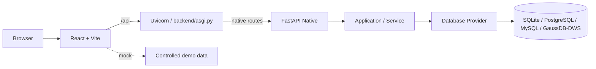

# 架构说明

## Runtime Truth

当前后端是纯 FastAPI ASGI 运行时：

```text
Uvicorn
  ↓
backend/asgi.py
  ↓
FastAPI Native
  ↓
Application / Service
  ↓
Database Provider
```

生产和默认开发入口均为：

```bash
uvicorn backend.asgi:app --host 127.0.0.1 --port 5099
```

`backend/run.py`、Waitress、WSGI fallback 和 runtime switch 均已退休；当前没有第二套 Flask runtime。`GET /healthz` 只报告进程状态，固定返回 `runtime=fastapi` 和 `fastapiPrimary=true`，不执行数据库查询。

## 请求分发



`backend/app/fastapi/app.py` 统一注册仓库 native routers；`backend/asgi.py` 只负责 FastAPI composition、CORS/security headers 和 healthz。数据库、驱动、凭据、storage 或 external integration readiness 不改变已存在 route 的注册状态。

## Terminology and responsibility boundaries

以下职责矩阵是 backend、frontend、API 和文档共同遵循的 repository truth。它把“仓库里有什么”“实例显示什么”“用户能做什么”“部署如何运行”和“依赖是否可用”分成正交维度：

| 概念 | 职责 / Source of truth | 可以影响 | 明确不能影响 |
| --- | --- | --- | --- |
| **Module** | 仓库/产品领域身份；backend `app/core/modules.py`、frontend `src/modules/moduleRegistry.js` 及静态 composition/provider registry | module code、名称、路径、route/provider/search/stat identity | RBAC、菜单可见性、license/Edition、数据库连接或外部 readiness |
| **Capability** | 现有 `/api/capabilities` 的兼容性公开表示；当前实际是 source-backed open module contract，由 module manifest 生成 | capability payload 及前端加载诊断；`modules[].enabled` / `reason` 是兼容字段 | license/Edition entitlement、菜单 status、RBAC、runtime profile、route registration 或依赖 readiness |
| **Readiness / Diagnostics** | 运行时依赖和集成的实际状态：database connectivity、driver、storage、credentials、external service 等，由 provider/service error contract 表达 | 请求级成功、降级或可诊断错误 | Module identity、源码/route 存在性、菜单、RBAC、Edition |
| **Menu Status** | 实例导航配置，事实源是 `p_menu.status` 及菜单排序/位置字段 | 导航展示，以及门户/搜索/统计的实例可见性过滤 | 删除源码模块、取消 route、后端授权、license、数据库可用性 |
| **RBAC Permission** | 当前用户授权，事实源是 permission registry 与 role → permission mapping；后端 `require_permission` 是 enforcement | 受保护 API 的读写/管理操作；前端隐藏按钮仅是 UX | Module 是否存在、菜单实例配置、deployment readiness、runtime profile |
| **Runtime / DB Profile** | 连接、provider 和部署选择，事实源是 `ASSET_RUNTIME_PROFILE`、`ASSET_DB_PROFILE` 与 profile config | 数据库/provider、连接参数、部署默认值和集成选择 | Module identity、license、菜单、用户 permission |

因此：**Module availability is not a licensing gate.** 仓库中的 source-backed 模块默认属于同一 open product surface；菜单隐藏不等于 route 删除或 API 禁止，RBAC 不等于模块存在性，runtime/DB profile 不等于 feature flag。**Menu visibility is not authorization. RBAC authorization is not module availability. Runtime/DB profile is not feature gating. Readiness failure does not remove repository routes. Capabilities must not be interpreted as Community/Private Edition locking.**

数据库层的 `BackendCapability` / `BackendCapabilities` 是 provider adapter 的基础设施支持矩阵（例如 transaction、JDBC 或 connection pool），虽然复用了 capability 这个英文词，也不属于 `/api/capabilities` module payload，更不是 license 或模块隐藏开关。

前端 `frontend/src/capabilities/capabilities.js` 中的 `loadStatus` / `loadError` 只表示 `/api/capabilities` HTTP 请求的加载结果（`ready` 或 `error`），不是 deployment readiness。请求失败时保留全部 registry module codes；具体模块若依赖数据库或外部集成，会在自己的 service/API contract 中报告诊断状态。

### FastAPI current route surface

当前 FastAPI adapter 负责下列 native routes；所有仓库模块默认注册，实例菜单可见性与外部 readiness 在更上层/Service contract 中单独表达：

- Indicator：`/api/indicators`
- Assets / DWM：`/api/assets`
- Field Mapping：`/api/field-mappings`
- Root：`/api/roots`
- Manual Code Table：`/api/manual-code-tables`
- Report：`/api/reports`
- API Asset：`/api/api-assets`
- Lineage：`/api/lineage`
- Metadata Ingestion：`/api/metadata`（versioned external Asset / Lineage Contract）
- Auth：`/api/auth`（native signed-session adapter）
- Capabilities：`/api/capabilities`（native infrastructure adapter）
- Portal Stats：`/api/portal/stats`（native infrastructure adapter）
- Unified Search：`/api/search`（native infrastructure adapter）
- System Management：`/api/system`
- Operation Log：`/api/operation-logs`
- Upstream：`/api/upstreams`
- Push：`/api/push`

模块级 parity 和 migration 状态见 [FastAPI P4 Migration Matrix](./fastapi-p4-migration-matrix.md)。

### Scope exclusions

以下路径不属于当前 native module route contract：

- Common Code：`/api/common-codes/*`（WAIT_DB，保留为后续基础设施边界）
- Indicator Path：当前没有独立 native route
- 任何真正不存在的请求返回 FastAPI `NOT_FOUND` envelope；外部依赖缺失的已注册模块使用 service error contract。

仓库模块不会因为 runtime profile 名称而意外隐藏；实例菜单 status 仍可控制导航可见性。

## Application Boundary

HTTP adapter 只负责请求解析、公开目录响应投影、认证依赖、contract validation、response envelope 和 adapter-specific error mapping。普通业务 catalog GET 按显式 Public Catalog 路由接受匿名请求；mutation、admin 或 sensitive read 继续叠加 `require_permission(...)`，因此 Authentication 不等于 Authorization：

```text
FastAPI adapter ── Application / Service Layer ── Database Provider ── Database
```

`backend/app/contracts/` 是框架中立的 API Contract，由 FastAPI native adapter 复用；Service、Contract 和 Database Layer 不因 runtime retirement 复制业务逻辑。

- `backend/asgi.py` 负责纯 FastAPI composition、CORS/security headers、native signed-session identity resolver 和 healthz。
- `backend/app/fastapi_app.py` 是保留历史 import path 的 thin compatibility facade。
- `backend/app/fastapi/app.py` 负责 FastAPI app bootstrap、explicit Service injection、capability payload 与静态 Router registration；capability、menu、profile 或 readiness 状态都不作为 route gate。`dependencies.py`、`errors.py` 和 `routers/` 承载共享 adapter seam 与模块边界。渐进迁移的 module-level router convention、inventory 和 operation-log pilot 见 [`fastapi-router-convention.md`](fastapi-router-convention.md)。
- `backend/app/__init__.py` 仅保留 production composition 说明；历史 Flask factory/blueprint 已删除，native package import 不加载 Flask。
- `backend/app/services/` 和 `backend/app/db/` 是 FastAPI native 复用的业务与数据库边界。

## Metadata Integration Boundary

外部元数据不直接写业务表，而是通过版本化 Contract 进入 FastAPI：

```text
External Collector / Adapter
          ↓
Versioned Metadata Contract
          ↓
/api/metadata/assets/ingestions
/api/metadata/lineage/ingestions
          ↓
MetadataIngestionService
          ↓
SQLAlchemy Core / Database Provider
          ↓
Canonical asset / lineage storage
```

`backend/app/contracts/metadata_ingestion.py` 是 framework-neutral public DTO；`backend/app/services/metadata_ingestion_service.py` 负责 source identity、normalize、natural key、idempotency、dry-run、bulk limits、transaction、snapshot activation 和 audit summary；`backend/app/fastapi/routers/metadata.py` 只负责 auth、request parsing、HTTP status mapping。Collector 不需要知道 `p_asset_*`、`p_lineage_*`、内部 PK、Provider 或 migration。完整字段与语义见 [metadata-ingestion.md](./metadata-ingestion.md) 和 [ADR-001](./adr/001-metadata-ingestion-contract.md)。

V1 lineage 只支持 self-contained `replace` snapshot：新 snapshot 先以 `INACTIVE` 写入，节点/边校验成功后在同一 transaction 内切换 `ACTIVE`。`append`、`merge`、source-specific parser、scheduler 和 connector framework 不属于 DAP Core。

## Rollback

F6 不再提供 Flask runtime rollback switch。应用回滚通过部署上一版已验证的 Git commit/image 完成；不回滚数据库 schema、migration、Service 或 API Contract。`uvicorn backend.asgi:app` 是唯一当前推荐入口。

## Transitional Debt

### F7 cleanup result

F5 gate 已证明 production native composition 不加载 Flask；F7 已删除 Flask/Flask-Cors dependencies、Flask factory/blueprints/routes 与 obsolete compatibility tests。#145 进一步移除了 `FLASK_*` runtime names 和历史 health flag；保留的 `Werkzeug`（AuthService password hashing）、`itsdangerous`（native signed session）和薄 `fastapi_app.py` facade 均有明确 native reason。旧 signed cookie 仅在有限生命周期内只读迁移为 HMAC-SHA256 native cookie。当前生成的 architecture artifact 以可审计 source revision 为证据；历史 migration notes 中的旧图示不应被当作 current runtime truth。

## 前端与数据层

- `frontend/src/App.jsx` 负责应用编排、登录态和模块路由；`frontend/src/api/` 统一访问 `/api`。
- `VITE_API_MODE=mock` 使用受控前端演示数据；`remote` 访问真实后端数据库。两种模式默认使用同一仓库模块集合，数据和外部执行能力可以不同。
- Schema deployment contract 是 `backend/schema` 下四份 versioned dialect baseline 加 `backend/alembic` immutable forward revisions；baseline 是 fresh-install/offline physical artifact set，Alembic 负责 existing-database/head upgrade，二者不是同一个来源。`backend/app/db/tables.py` 只承载 runtime SQLAlchemy Core 查询子集，`demo/seed_*.py` 负责完整仓库模块的虚构演示数据。完整职责与编辑顺序见 [ADR-002](./adr/002-schema-canonical-source.md)。
- `backend/app/db/` 隔离 SQLite、PostgreSQL、MySQL 和 GaussDB/DWS 的 Provider 差异；数据库 profile 只表达部署连接能力。`docs/pg/`、`docs/dws/` 是方言参考和部署说明，不再作为隐藏模块的 schema 边界。
- 正式部署由 Nginx 托管前端静态资源，并将 `/api` 代理到 ASGI runtime；详细环境变量、health check 与 Nginx 配置见 [DEPLOYMENT.md](../DEPLOYMENT.md)。

## Schema ownership boundary

四方言 baseline 必须保持共同的 logical table/column/constraint/index inventory，但 SQLite attached schema、PostgreSQL identity、MySQL storage/row-size rules 和 DWS distribution/JDBC clauses 属于 physical deployment contract，不能被 generic PostgreSQL/SQLAlchemy compiler 默认抹平。`0001_baseline` 只是 ledger marker；fresh install 先执行 selected baseline，再按 provider capability 应用 forward head。详见 [ADR-002](./adr/002-schema-canonical-source.md)。

## 当前边界与后续 Issue

仓库已有模块均默认进入统一的 route、repository-module capability contract、schema、seed、search 和 portal statistics contract。`backend/configs/community.yaml` 仅保留本地演示的数据库/集成配置；`p_menu.status` 仍是实例级可见性配置。WAIT_DB 或外部存储/驱动未配置时，模块 route 仍存在，由现有 Service error contract 返回可诊断状态。
