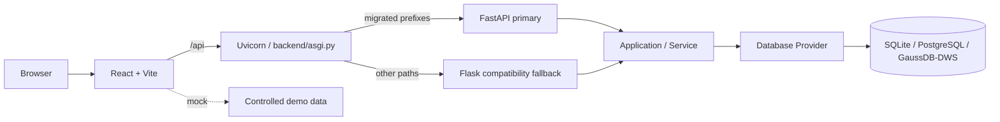

# 架构说明

## Runtime Truth

当前后端是一个带有兼容边界的 ASGI 运行时：

```text
Uvicorn
  ↓
backend/asgi.py
  ├── FastAPI primary：已迁移且已启用的 API prefix
  └── Flask WSGI fallback：未迁移、基础设施和兼容路径
```

`BACKEND_RUNTIME` 默认值为 `fastapi`。生产和默认开发入口均为：

```bash
uvicorn backend.asgi:app --host 127.0.0.1 --port 5099
```

`backend/run.py` 仍然创建直接 Flask application，但只用于本地 development server 或绕过 ASGI dispatcher 的 emergency rollback；它不是默认生产入口。

## 请求分发



`backend/asgi.py` 根据 capability map 计算已迁移 prefix，再由 `RuntimeDispatcher` 选择 adapter。FastAPI 和 Flask 不是两套业务实现：两者都进入相同的 Application / Service Layer，并通过 Database Provider 访问数据。

### FastAPI primary 覆盖范围

当前 FastAPI adapter 承载下列已迁移模块；带 `*` 的模块受完整 profile / capability 控制，Community 默认不会注册：

- Indicator：`/api/indicators`
- Assets / DWM：`/api/assets`
- Field Mapping：`/api/field-mappings`
- Root：`/api/roots`
- Manual Code Table*：`/api/manual-code-tables`
- Report*：`/api/reports`
- API Asset：`/api/api-assets`
- Lineage：`/api/lineage`
- Auth：`/api/auth`（native signed-session adapter）
- Capabilities：`/api/capabilities`（native infrastructure adapter）
- Portal Stats：`/api/portal/stats`（native infrastructure adapter）
- Unified Search：`/api/search`（native infrastructure adapter）
- System Management：`/api/system`
- Operation Log：`/api/operation-logs`
- Upstream*：`/api/upstreams`

具体 prefix gate 由 `backend/asgi.py` 的 `FASTAPI_MODULE_PREFIXES` 定义；模块级 parity 和 migration 状态见 [FastAPI P4 Migration Matrix](./fastapi-p4-migration-matrix.md)。

### Flask compatibility fallback

以下路径当前仍由 Flask fallback 提供，或依赖 Flask runtime compatibility seam：

- Common Code：`/api/common-codes/*`（WAIT_DB）
- WAIT_DB 模块：Indicator Path、Common Code、Push
- 任何未命中 FastAPI migrated prefix 的请求

已迁移模块的 Flask blueprints 也必须继续保留，因为它们是 fallback、rollback 和 parity tests 的安全边界。Community profile 的 disabled/private 路径仍由 capability gate 控制，不会因为 FastAPI primary 而意外暴露。

## Application Boundary

HTTP adapter 只负责请求解析、认证依赖、contract validation、response envelope 和 adapter-specific error mapping：

```text
FastAPI adapter ─┐
                  ├── Application / Service Layer ── Database Provider ── Database
Flask adapter  ──┘
```

`backend/app/contracts/` 是框架中立的 API Contract，由 Flask compatibility adapter 与 FastAPI primary adapter 共同复用。Service、Contract 和 Database Layer 不因 dual runtime 复制两份业务逻辑。

- `backend/asgi.py` 负责 runtime dispatch、CORS/security headers、native signed-session identity resolver、Flask request-context compatibility 和 runtime switch。
- `backend/app/fastapi_app.py` 是保留历史 import path 的 thin compatibility facade。
- `backend/app/fastapi/app.py` 负责 FastAPI app bootstrap、explicit Service injection、capability gate 与 Router registration；`dependencies.py`、`errors.py` 和 `routers/` 承载共享 adapter seam 与模块边界。
- `backend/app/__init__.py` 负责 Flask app factory 与 Flask fallback 的 blueprint 装配。
- `backend/app/services/` 和 `backend/app/db/` 是两种 HTTP adapter 共享的业务与数据库边界。

## Rollback / Compatibility Mode

优先使用同一个 ASGI entrypoint 切换到 Flask：

```bash
BACKEND_RUNTIME=flask uvicorn backend.asgi:app --host 127.0.0.1 --port 5099
```

这会让所有业务请求进入 Flask fallback，同时保留 `/healthz` 的 runtime 标识。若需要完全绕过 ASGI dispatcher，可安装并使用 Waitress 直接承载 Flask WSGI application：

```bash
BACKEND_RUNTIME=flask waitress-serve --host 127.0.0.1 --port 5099 backend.run:app
```

回滚不需要回退数据库 schema、migration、Service 或已合并的 FastAPI adapter。`python backend/run.py` 只适合本地 development server，不应作为生产 rollback server。

## Transitional Debt

Flask 尚不能安全移除，原因是它仍承担明确的 compatibility responsibilities：

- FastAPI primary 的 Auth 使用 framework-neutral signed-session codec 读取与 Flask 兼容的 `session` cookie；Flask auth blueprint 仅作为 fallback/rollback boundary 保留。
- `Operation Log Service` 已通过 F1 `RequestContext` adapter 获取 URL、method、user-agent、client IP 和 actor，不再读取 Flask request-local state。
- Common Code 以及 Indicator Path、Push 尚未形成独立的 FastAPI runtime contract 或 DB_READY migration boundary；Portal/Search/Capabilities 已由 F3 native infrastructure adapter 承载。
- 已迁移模块的 Flask blueprints、Flask test client 和 parity tests 仍是 rollback / compatibility 证据。
- `backend/run.py` 提供不依赖 ASGI dispatcher 的直接 WSGI emergency path。

因此当前准确的架构描述是 **FastAPI primary + Flask compatibility fallback**，不是“所有 API 已完全迁移 FastAPI”，也不是“Flask 仅作为未清理遗留代码存在”。

## 前端与数据层

- `frontend/src/App.jsx` 负责应用编排、登录态和模块路由；`frontend/src/api/` 统一访问 `/api`。
- `VITE_API_MODE=mock` 使用受控前端演示数据；`remote` 访问真实后端数据库。
- Schema Source of Truth 是 `backend/schema` 完整基线加 `backend/alembic` 增量 revision。
- `backend/app/db/` 隔离 SQLite、PostgreSQL、MySQL 和 GaussDB/DWS 的 Provider 差异；Community 默认启用的数据库路径由 runtime profile 控制。
- 正式部署由 Nginx 托管前端静态资源，并将 `/api` 代理到 ASGI runtime；详细环境变量、health check 与 Nginx 配置见 [DEPLOYMENT.md](../DEPLOYMENT.md)。
