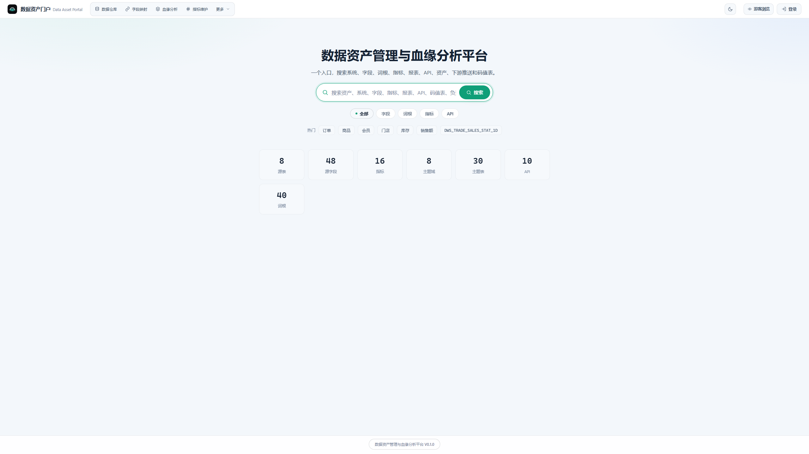
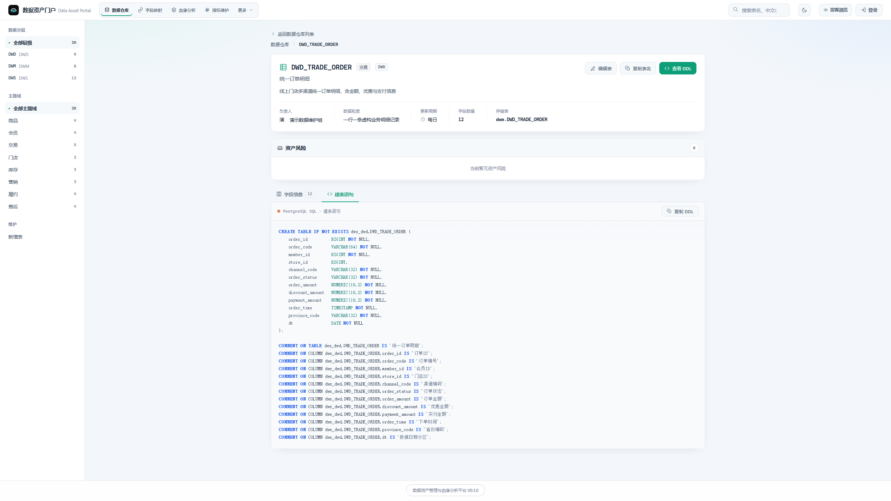
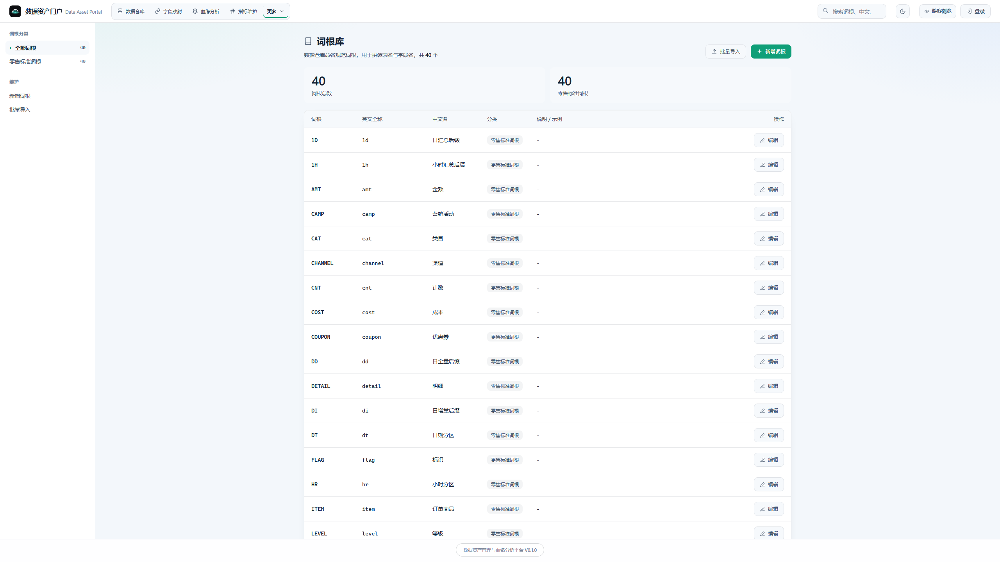
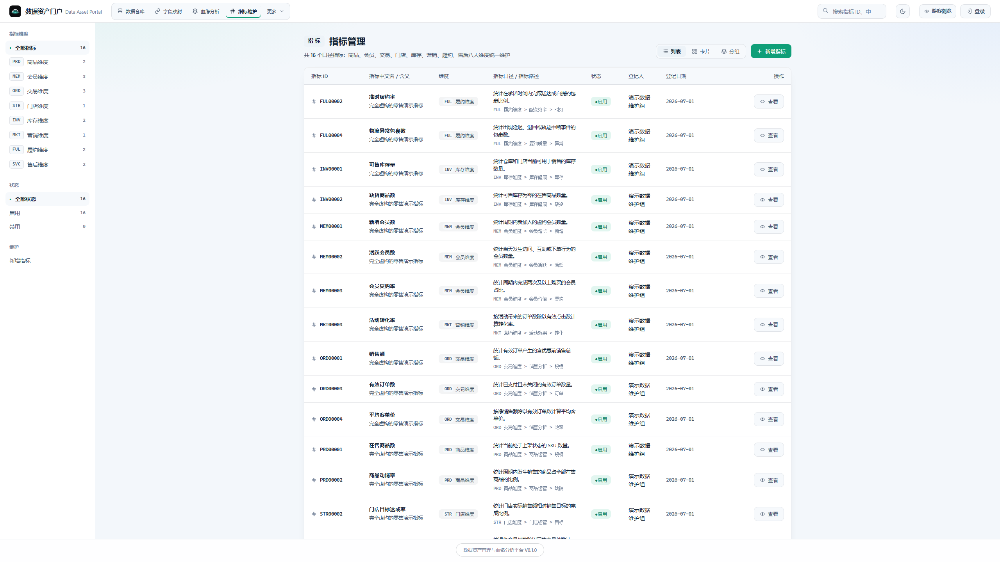
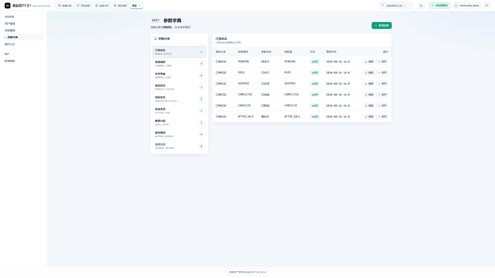

# 📸 界面截图画廊

> 以下截图均来自仓库 **Repository Community Demo**（`demo/datasets/` 虚构零售数据）真实运行的
> **SQLite → Service → FastAPI/Uvicorn → Frontend** 链路，前端无任何写死的演示假数据。
> 截图基于 `2560×1440` 视口拍摄；完整可复现流程见 [Community Demo 指南](./community-demo.md)。它们不代表线上独立 static/mock bundle，也不自动代表当前 `origin/main` 的全部 route coverage。

## 资产门户总览

首页聚合全部数据资产类型与统计，是进入平台的第一屏。

## 数据资产（主题表）

30 张主题表按 DWD / DWM / DWS 分层，覆盖 8 个主题域，含中文名、负责人与字段数。

## 表资产详情

表基本信息、字段元数据（中文名 / 类型 / 主键 / 分区 / 枚举说明）与资产风险一目了然。

## 表 DDL

自动生成建表语句与字段注释（PostgreSQL 方言），支持一键复制。

## 统一搜索

一个关键词可跨 **资产 / 字段 / 词根 / 指标 / API** 统一发现，并标注命中位置。

## 字段映射

源系统表 → DWD 目标表的字段映射，8 个源系统、48 个字段 100% 覆盖。

## 数据标准（词根）

40 个零售标准词根，用于拼装表名与字段名。

## 指标维护

16 个口径指标，覆盖商品 / 会员 / 交易 / 门店 / 库存 / 营销 / 履约 / 售后八大维度，
每个指标均关联结果表与指标路径。

## 系统管理 · 参数字典

9 类参数字典、33 项字典值统一维护（需以 Community Demo 演示账号登录）。

---

## 说明

- 所有数据均为**虚构零售演示数据**，不包含任何真实业务信息。
- 截图来自 repository Community remote path；如果页面显示 `V0.1.0`，它表示 frontend application/build metadata，不是线上 static Demo 的 `V1.0.0`，也不改变 published GitHub Release `v0.1.1` 的语义。
- 血缘分析页（POC）暂未纳入公开截图，等待 Demo 口径确认后补充；未出现在画廊不表示该 route 在所有 profile 都不可用。
